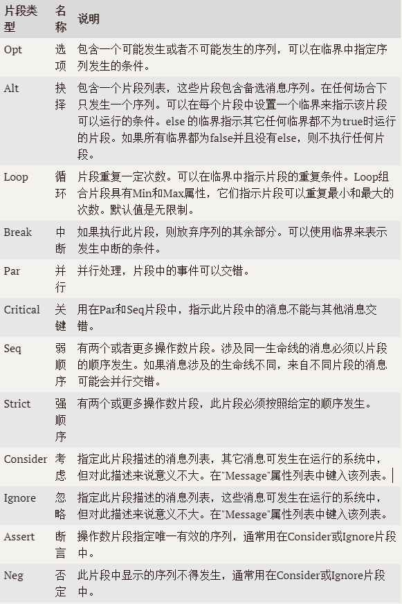
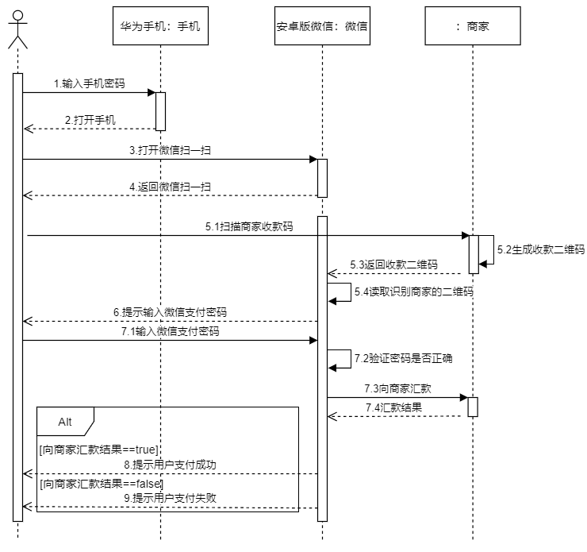

# UML时序图

时序图(Sequence Diagram)，又名序列图、循序图，是一种UML交互图。它通过描述对象之间发送消息的时间顺序显示多个对象之间的动态协作。

## 时序图的元素

序图时会涉及7种元素：角色(Actor)、对象(Object)、生命线(LifeLine)、控制焦点(Activation)、消息(Message)、自关联消息、组合片段。

### 角色(Actor)

系统角色，可以是人或者其他系统，子系统。以一个小人图标表示。

### 对象(Object)

对象位于时序图的顶部,以一个矩形表示。对象的命名方式一般有三种：

- 对象名和类名
- 只显示类名，不显示对象，即为一个匿名类
- 只显示对象名，不显示类名

### 生命线(LifeLine)

时序图中每个对象和底部中心都有一条垂直的虚线，这就是对象的生命线(对象的时间线)。以一条垂直的虚线表示。

### 控制焦点(Activation)

控制焦点代表时序图中在对象时间线上某段时期执行的操作。以一个很窄的矩形表示。

### 消息(Message)

表现代表对象之间发送的信息。消息分为三种类型：

- **同步消息(Synchronous Message)**：消息的发送者把控制传递给消息的接收者，然后停止活动，等待消息的接收者放弃或者返回控制。用来表示同步的意义。以一条实线+实心箭头表示。
- **异步消息(Asynchronous Message)**：消息发送者通过消息把信号传递给消息的接收者，然后继续自己的活动，不等待接受者返回消息或者控制。异步消息的接收者和发送者是并发工作的。以一条实线+大于号表示。
-  **返回消息(Return Message)**：返回消息表示从过程调用返回。以小于号+虚线表示。

### 自关联消息

表示方法的自身调用或者一个对象内的一个方法调用另外一个方法。以一个半闭合的长方形+下方实心剪头表示。

### 组合片段

组合片段用来解决交互执行的条件和方式，它允许在序列图中直接表示逻辑组件，用于通过指定条件或子进程的应用区域，为任何生命线的任何部分定义特殊条件和子进程。组合片段共有13种，名称及含义如下：

## 示例

示例，使用手机微信支付的时序图：

