# UML类图

## 类

类封装了数据和行为，是面向对象的重要组成部分，它是具有相同属性、操作、关系的对象集合的总称。

- 在系统中，每个类都具有一定的职责，职责指的是类要完成什么样的功能，要承担什么样的义务。一个类可以有多种职责，设计得好的类一般只有一种职责。
- 在定义类的时候，将类的职责分解成为类的属性和操作（即方法）。类的属性即类的数据职责，类的操作即类的行为职责。
- 设计类是面向对象设计中最重要的组成部分，也是最复杂和最耗时的部分。

在系统分析与设计阶段，类通常可以分为三种，分别是实体类(Entity Class)、控制类(Control Class)和边界类(Boundary Class)：

- **实体类**：实体类对应系统需求中的每个实体，它们通常需要保存在永久存储体中，一般使用数据库表或文件来记录，实体类既包括存储和传递数据的类，还包括操作数据的类。实体类来源于需求说明中的名词，如学生、商品等。
- **控制类**：控制类用于体现应用程序的执行逻辑，提供相应的业务操作，将控制类抽象出来可以降低界面和数据库之间的耦合度。控制类一般是由动宾结构的短语（动词+名词）转化来的名词，如增加商品对应有一个商品增加类，注册对应有一个用户注册类等。
- **边界类**：边界类用于对外部用户与系统之间的交互对象进行抽象，主要包括界面类，如对话框、窗口、菜单等。

在面向对象分析和设计的初级阶段，通常首先识别出实体类，绘制初始类图，此时的类图也可称为领域模型，包括实体类及其它们之间的相互关系。

## 类的UML图示

在UML中，类使用包含类名、属性和操作且带有分隔线的长方形来表示，如定义一个Employee类，它包含属性name、age和email，以及操作modifyInfo()，在UML类图中该类如图所示：

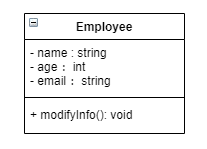

对应的代码为：

```
class Employee
{
public: 
	void modifyInfo();
private:
	string name;
	int age;
	string email;
};
```

在UML类图中，类一般由三部分组成：

- 第一部分是类名：每个类都必须有一个名字，类名是一个字符串。如果类是一个抽象类，则类名使用斜体字表示。
- 第二部分是类的属性(Attributes)：属性是指类的性质，即类的成员变量。一个类可以有任意多个属性，也可以没有属性，ML规定属性的表示方式为：`可见性 名称:类型 [ = 缺省值 ]`：
  - 可见性表示该属性对于类外的元素而言是否可见，包括public、private和protected三种，在类图中分别用符号`+`、`-`和`#`表示。
  - 名称表示属性名，用一个字符串表示。
  - 类型表示属性的数据类型，可以是基本数据类型，也可以是用户自定义类型。
  - 缺省值是一个可选项，即属性的初始值。

- 第三部分是类的操作(Operations)：操作是类的任意一个实例对象都可以使用的行为，是类的成员方法。UML规定操作的表示方式为：`可见性 名称(参数列表) [ : 返回类型]`：
  - 可见性的定义与属性的可见性定义相同。
  - 名称即方法名，用一个字符串表示。
  - 参数列表表示方法的参数，其语法与属性的定义相似，参数个数是任意的，多个参数之间用逗号`,`隔开。
  - 返回类型是一个可选项，表示方法的返回值类型，依赖于具体的编程语言，可以是基本数据类型，也可以是用户自定义类型，还可以是空类型(void)，如果是构造方法，则无返回类型。

如果类中含有内部类，则可能出现四部分的类图。

## 类与类之间的关系

在软件系统中，类并不是孤立存在的，类与类之间存在各种关系，对于不同类型的关系，UML提供了不同的表示方式。

- 泛化关系
  - 泛化关系是一种继承的关系，表示一般与特殊的关系
  - 代码体现：继承方式
  - 表示方法：带三角形的箭头，箭头指向父类
- 实现关系
  - 实现关系表示一种类与接口的关系，表示类是接口所有特征和行为的实现
  - 代码体现：继承方式，继承自抽象类
  - 表示方法：带三角形的箭头，箭头指向父类
- 组合关系
  - 组合关系是整体和部分的关系，但是部分不能脱离整体而单独存在
  - 代码体现：成员变量
  - 表示方法：带实心菱形的实线，菱形指向整体
- 聚合关系
  - 聚合关系是整体和部分的关系，且部分可以脱离整体而单独存在
  - 代码体现：成员变量
  - 表示方法：带空心菱形的实线，菱形指向整体
- 关联关系
  - 关联关系表示一种拥有的关系，使得一个类知道另一个类的属性和方法
  - 代码实现：成员变量
  - 表示方法：带普通箭头的实心线，指向被拥有者
- 依赖关系
  - 依赖关系一种使用关系，即一个类的实现需要另一个类的协助，所以尽量不要使用双向依赖
  - 代码实现：局部变量，方法的参数或者对静态方法的调用
  - 表示方法：带箭头的虚线，指向被使用者。

### 泛化关系(Generalization)

例如：Student类和Teacher类都是Person类的子类，Student类和Teacher类继承了Person类的属性和方法：

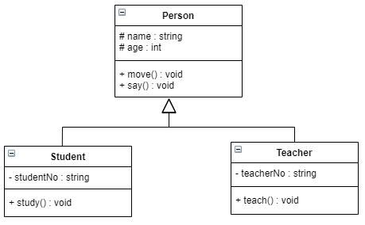

```
class Person
{
protected:
	string name;
	int age;
public:
	void move();
	void say();
};

class Student : public Person
{
private:
	string studentNo;
public:
	void study();
};

class Teacher : public Person
{
private:
	string teacherNo;
public:
	void teach();
};
```

### 实现关系(Realize)

例如：定义了一个交通工具接口Vehicle，包含一个抽象操作move()，在类Ship和类Car中都实现了该move()操作，不过具体的实现细节将会不一样：

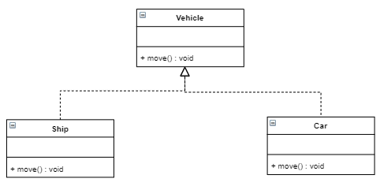

```
class Vehicle
{
public:
	virtual void move() = 0;
}

class Ship : public Vehicle
{
public:
	virtual void move() override;
}

class Car : public Vehicle
{
public:
	virtual void move() override;
}
```

### 聚合关系(Aggregation)

例如：汽车发动机(Engine)是汽车(Car)的组成部分，但是汽车发动机可以独立存在，因此，汽车和发动机是聚合关系：

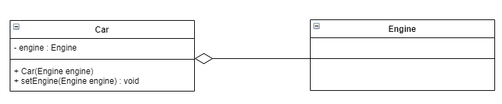

在代码实现聚合关系时，成员对象通常作为构造方法、Set方法或业务方法的参数注入到整体对象中：

```
class Car
{
	Engine engine;
public:
	//@ 构造注入
	Car(Engine engine) : engine(engine){}

	//@ Set方法注入
	void SetEngine(Engine engine)
	{
		engine = engine;
	}
};
```

### 组合关系(Composition)

例如：人的头部与嘴巴，嘴巴是头的组成部分之一，而且如果头部没了，嘴巴也就没了，因此头和嘴巴是组合关系：

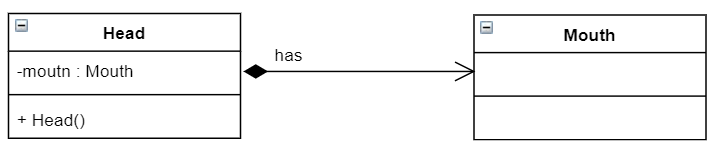

在代码实现组合关系时，通常在整体类的构造方法中直接实例化成员类：

```
class Head
{
private:
	Mouth* mouth;

public:
	Head() {
		mouth = new Mouth();
	}
};
```

### 依赖关系(Dependency)

例如：驾驶员开车，在Driver类的drive()方法中将Car类型的对象car作为一个参数传递，以便在drive()方法中能够调用car的move()方法，且驾驶员的drive()方法依赖车的move()方法，因此类Driver依赖类Car：

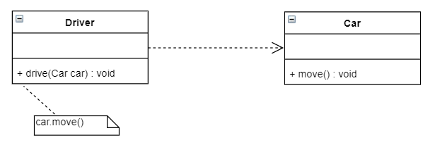

在系统实施阶段，依赖关系通常通过三种方式来实现：

- 第一种也是最常用的一种方式是如图所示的将一个类的对象作为另一个类中方法的参数
- 第二种方式是在一个类的方法中将另一个类的对象作为其局部变量
- 第三种方式是在一个类的方法中调用另一个类的静态方法

上图所示的实现代码：

```
class Car
{
public:
	void move();
};

class Driver
{
public:
	void drive(Car car)
	{
		car.move();
	}
};
```

### 关联关系(Association)

在使用类图表示关联关系时可以在关联线上标注角色名，一般使用一个表示两者之间关系的动词或者名词表示角色名（有时该名词为实例对象名），关系的两端代表两种不同的角色，因此在一个关联关系中可以包含两个角色名，角色名不是必须的，可以根据需要增加，其目的是使类之间的关系更加明确。

#### 双向关联

默认情况下，关联是双向的。例如：顾客(Customer)购买商品(Product)并拥有商品，反之，卖出的商品总有某个顾客与之相关联。因此，Customer类和Product类之间具有双向关联关系：

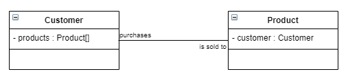

#### 单向关联

类的关联关系也可以是单向的，单向关联用带箭头的实线表示。例如：顾客(Customer)拥有地址(Address)，则Customer类与Address类具有单向关联关系：

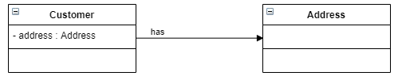

#### 自关联

在系统中可能会存在一些类的属性对象类型为该类本身，这种特殊的关联关系称为自关联。例如：一个节点类(Node)的成员又是节点Node类型的对象：

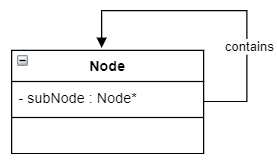

```
class Node
{
private:
	Node* subNode;
};
```

#### 多重性关联

多重性关联关系又称为重数性(Multiplicity)关联关系，表示两个关联对象在数量上的对应关系。在UML中，对象之间的多重性可以直接在关联直线上用一个数字或一个数字范围表示。

对象之间可以存在多种多重性关联关系，常见的多重性表示方式：

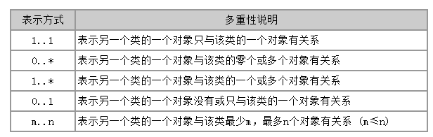

一个界面(Form)可以拥有零个或多个按钮(Button)，但是一个按钮只能属于一个界面，因此，一个Form类的对象可以与零个或多个Button类的对象相关联，但一个Button类的对象只能与一个Form类的对象关联：

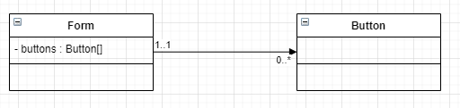

```
class Form
{
private:
		Button buttons[];
};
```

