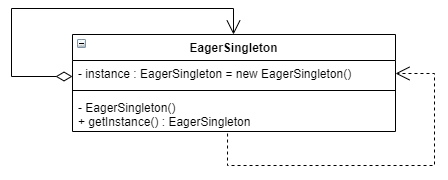
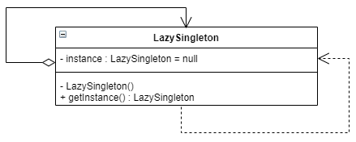

# 单例模式

单例模式是一种创建型设计模式， 让你能够保证一个类只有一个实例， 并提供一个访问该实例的全局节点。


确保某一个类只有一个实例，而且自行实例化并向整个系统提供这个实例，这个类称为单例类，它提供全局访问的方法。单例模式是一种对象创建型模式。

单例模式有三个要点：

- 一是某个类只能有一个实例
- 二是它必须自行创建这个实例
- 三是它必须自行向整个系统提供这个实例

单例模式是结构最简单的设计模式一，在它的核心结构中只包含一个被称为单例类的特殊类。单例模式结构如图所示：


在单例类的内部实现只生成一个实例，同时它提供一个静态的getInstance()工厂方法，让客户可以访问它的唯一实例；为了防止在外部对其实例化，将其构造函数设计为私有；在单例类内部定义了一个Singleton类型的静态对象，作为外部共享的唯一实例。

## 问题

单例模式同时解决了两个问题， 所以违反了单一职责原则：

- 保证一个类只有一个实例。 为什么会有人想要控制一个类所拥有的实例数量？ 最常见的原因是控制某些共享资源 （例如数据库或文件） 的访问权限。它的运作方式是这样的： 如果你创建了一个对象， 同时过一会儿后你决定再创建一个新对象， 此时你会获得之前已创建的对象， 而不是一个新对象。
- 为该实例提供一个全局访问节点。和全局变量一样， 单例模式也允许在程序的任何地方访问特定对象， 但是它可以保护该实例不被其他代码覆盖。


## 解决方案

所有单例的实现都包含以下两个相同的步骤：

- 将默认构造函数设为私有， 防止其他对象使用单例类的 `new`运算符。
- 新建一个静态构建方法作为构造函数。 该函数会 “偷偷” 调用私有构造函数来创建对象，并将其保存在一个静态成员变量中。 此后所有对于该函数的调用都将返回这一缓存对象。

如果你的代码能够访问单例类， 那它就能调用单例类的静态方法。 无论何时调用该方法， 它总是会返回相同的对象。

## 单例模式结构


单例 （Singleton） 类声明了一个名为 `get­Instance` 获取实例的静态方法来返回其所属类的一个相同实例。单例的构造函数必须对客户端 （Client） 代码隐藏。 调用 获取实例方法必须是获取单例对象的唯一方式。

## 代码示例

### 饿汉式单例类

饿汉式单例类是实现起来最简单的单例类，饿汉式单例类结构图如图所示：



由于在定义静态变量的时候实例化单例类，因此在类加载的时候就已经创建了单例对象，代码如下所示：

```
class EagerSingleton {
private:
	EagerSingleton() {}
	static EagerSingleton* instance;
public:
	static EagerSingleton* getInstance()
	{
		return instance;
	}
};
EagerSingleton* EagerSingleton::instance = new EagerSingleton();
```

### 懒汉式单例与多线程安全



懒汉式单例在第一次调用`getInstance()`方法时实例化，在类加载时并不自行实例化，这种技术又称为延迟加载(Lazy Load)技术，即需要的时候再加载实例，为了避免多个线程同时调用`getInstance()`方法：

```
class LazySingleton {
private:
	LazySingleton() {}
	static LazySingleton* instance;
public:
	static LazySingleton* getInstance()
	{
		if (instance == nullptr)
			instance = new LazySingleton();
		return instance;
	}
};
```

上面的代码并非是线程安全的，可能出现反复 new LazySingleton的情况，解决的办法是加一把互斥锁：

```
class LazySingleton {
private:
	LazySingleton() {}
	static LazySingleton* instance;
	static std::mutex _mutex;
public:
	static LazySingleton* getInstance()
	{
		std::lock_guard<std::mutex> lock(_mutex);
		if (instance == nullptr)
			instance = new LazySingleton();
		return instance;
	}
};
```

但是加锁的消耗和代价是比较大的，于是出现了"双重检查锁定"的方法：

```
class LazySingleton {
private:
	LazySingleton() {}
	static LazySingleton* instance;
	static std::mutex _mutex;
public:
	static LazySingleton* getInstance()
	{
		if(instance == nullptr)
		{ 
			std::lock_guard<std::mutex> lock(_mutex);
			if (instance == nullptr)
				instance = new LazySingleton();
		}
		return instance;
	}
};
```

但是"双重检查锁定"也存在一个问题：指令重排，对于语句：`instance = new LazySingleton();`可以分解为如下几个不重要：

- 1.分配对象的内存空间
- 2.初始化对象
- 3.设置instance指向刚分配的内存地址

当`instance`指向分配地址时，`instance`不为空。

但是2、3部之间，可能会被重排序，造成创建对象顺序变为1-3-2.试想一个场景：

- 线程A第一次创建对象`LazySingleton`，对象创建顺序为1-3-2；
- 当给`instance`分配完内存后，这时来了一个线程B调用了`getInstance()`方法，这时候进行`instance == nullptr`的判断，发现`instance`并不为`nullptr`。
- 但注意这时候`instance`并没有初始化对象，线程B则会将这个未初始化完成的对象返回。那B线程使用`instance`时就可能会出现问题，这就是双重检查锁问题所在。

### C++11 之后的线程安全单例懒汉模式

#### 使用std::call_once

```
class LazySingleton {
public:
	static LazySingleton& getInstance() {
		static std::once_flag s_flag;
		std::call_once(s_flag, [&]() {
			instance = new LazySingleton(); });
		return *instance;
	}
private:
	LazySingleton();
	static LazySingleton* instance;
};
```

#### 使用局部静态变量

C++11中静态变量的初始化时线程安全的：

```
class LazySingleton {
public:
	static LazySingleton& getInstance() {
		static LazySingleton instance;
		return instance;
	}
private:
	LazySingleton();
};
```

## 单例模式总结

单例模式作为一种目标明确、结构简单、理解容易的设计模式，在软件开发中使用频率相当高，在很多应用软件和框架中都得以广泛应用。

### 实现方式

- 在类中添加一个私有静态成员变量用于保存单例实例。
- 声明一个公有静态构建方法用于获取单例实例。
- 在静态方法中实现"延迟初始化"。 该方法会在首次被调用时创建一个新对象， 并将其存储在静态成员变量中。 此后该方法每次被调用时都返回该实例。
- 将类的构造函数设为私有。 类的静态方法仍能调用构造函数， 但是其他对象不能调用。
- 检查客户端代码， 将对单例的构造函数的调用替换为对其静态构建方法的调用。

### 优点

- 可以保证一个类只有一个实例。
- 获得了一个指向该实例的全局访问节点。
-  仅在首次请求单例对象时对其进行初始化。

### 缺点

- 违反了单一职责原则。 该模式同时解决了两个问题。
- 单例模式可能掩盖不良设计， 比如程序各组件之间相互了解过多等。
- 该模式在多线程环境下需要进行特殊处理， 避免多个线程多次创建单例对象。

### 适用场景

- 系统只需要一个实例对象，如系统要求提供一个唯一的序列号生成器或资源管理器，或者需要考虑资源消耗太大而只允许创建一个对象。
- 客户调用类的单个实例只允许使用一个公共访问点，除了该公共访问点，不能通过其他途径访问该实例。