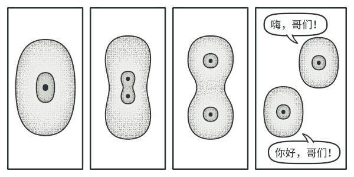

# 原型模式

在设计模式中也存在一个类似的模式，可以通过一个原型对象克隆出多个一模一样的对象，该模式称之为原型模式。

原型模式是一种创建型设计模式， 使你能够复制已有对象， 而又无需使代码依赖它们所属的类。


## 问题

如果你有一个对象， 并希望生成与其完全相同的一个复制品， 你该如何实现呢？

你必须新建一个属于相同类的对象。 然后， 你必须遍历原始对象的所有成员变量， 并将成员变量值复制到新对象中。但是并非所有对象都能通过这种方式进行复制， 因为有些对象可能拥有私有成员变量， 它们在对象本身以外是不可见的。

直接复制还有另外一个问题。 因为你必须知道对象所属的类才能创建复制品， 所以代码必须依赖该类。 即使你可以接受额外的依赖性， 那还有另外一个问题： 有时你只知道对象所实现的接口， 而不知道其所属的具体类， 比如可向方法的某个参数传入实现了某个接口的任何对象。

##  解决方案

原型模式将克隆过程委派给被克隆的实际对象。 模式为所有支持克隆的对象声明了一个通用接口， 该接口让你能够克隆对象， 同时又无需将代码和对象所属类耦合。 通常情况下， 这样的接口中仅包含一个**克隆**方法。克隆方法会创建一个当前类的对象， 然后将原始对象所有的成员变量值复制到新建的类中。 

支持克隆的对象即为**原型**。 当你的对象有几十个成员变量和几百种类型时， 对其进行克隆甚至可以代替子类的构造。

## 原型模式结构


- **原型** （Prototype） 接口将对克隆方法进行声明。 在绝大多数情况下， 其中只会有一个名为 `clone`克隆的方法。
- **具体原型** （Concrete Prototype） 类将实现克隆方法。 除了将原始对象的数据复制到克隆体中之外， 该方法有时还需处理克隆过程中的极端情况， 例如克隆关联对象和梳理递归依赖等等。
- **客户端** （Client）可以复制实现了原型接口的任何对象。

原型注册表实现：


**原型注册表** （Prototype Registry） 提供了一种访问常用原型的简单方法， 其中存储了一系列可供随时复制的预生成对象。 最简单的注册表原型是一个 `名称 → 原型`的哈希表。 但如果需要使用名称以外的条件进行搜索， 你可以创建更加完善的注册表版本。

## 真实世界类比

现实生活中， 产品在得到大规模生产前会使用原型进行各种测试。 但在这种情况下， 原型只是一种被动的工具， 不参与任何真正的生产活动。



由于工业原型并不是真正意义上的自我复制， 因此细胞有丝分裂 （还记得生物学知识吗？）或许是更恰当的类比。 有丝分裂会产生一对完全相同的细胞。 原始细胞就是一个原型， 它在复制体的生成过程中起到了推动作用。

## 代码示例

```
//@ 猴子
class Monkey
{
public:
	Monkey() = default;
	virtual ~Monkey() = default;
	virtual std::shared_ptr<Monkey> clone() = 0;
	virtual void play() = 0;
};


//@ 孙悟空
class SunWuKong : public Monkey
{
public:
	SunWuKong(string name) { strName_ = name; }
	~SunWuKong() {}

	SunWuKong(const SunWuKong &other)
	{
		strName_ = other.strName_;
	}

	//@ 拷贝构造函数
	virtual std::shared_ptr<Monkey> clone() override 
	{
		return std::make_shared<SunWuKong>(*this);
	}

	virtual void play() override
	{
		std::cout << strName_ << "  play Golden-Hoop-Stick" << std::endl;
	}

private:
	string strName_;
};

int main()
{
	std::unique_ptr<Monkey> pSWK(new SunWuKong("Qi Tian Da Sheng"));

	std::shared_ptr<Monkey> pSWK1 = pSWK->clone();
	std::shared_ptr<Monkey> pSWK2 = pSWK->clone();

	pSWK1->play();
	pSWK2->play();
}
```

## 原型模式总结

### 实现方式

- 创建原型接口， 并在其中声明**克隆**方法。 如果你已有类层次结构， 则只需在其所有类中添加该方法即可。
- 原型类必须另行定义一个以该类对象为参数的构造函数。 构造函数必须复制参数对象中的所有成员变量值到新建实体中。 如果你需要修改子类， 则必须调用父类构造函数， 让父类复制其私有成员变量值。
- 克隆方法通常只有一行代码： 使用 `new`运算符调用原型版本的构造函数。 注意， 每个类都必须显式重写克隆方法并使用自身类名调用 `new`运算符。 否则， 克隆方法可能会生成父类的对象。
- 你还可以创建一个中心化原型注册表， 用于存储常用原型。
  - 你可以新建一个工厂类来实现注册表， 或者在原型基类中添加一个获取原型的静态方法。该方法必须能够根据客户端代码设定的条件进行搜索。 搜索条件可以是简单的字符串， 或者是一组复杂的搜索参数。 找到合适的原型后， 注册表应对原型进行克隆， 并将复制生成的对象返回给客户端。
- 最后还要将对子类构造函数的直接调用替换为对原型注册表工厂方法的调用。

### 优点

- 可以克隆对象， 而无需与它们所属的具体类相耦合。
- 可以克隆预生成原型， 避免反复运行初始化代码。
- 可以更方便地生成复杂对象。
- 可以用继承以外的方式来处理复杂对象的不同配置。

### 缺点

- 克隆包含循环引用的复杂对象可能会非常麻烦。

### 适用场景

- 创建新对象成本较大（如初始化需要占用较长的时间，占用太多的CPU资源或网络资源），新的对象可以通过原型模式对已有对象进行复制来获得，如果是相似对象，则可以对其成员变量稍作修改。
-  如果系统要保存对象的状态，而对象的状态变化很小，或者对象本身占用内存较少时，可以使用原型模式配合备忘录模式来实现。
- 需要避免使用分层次的工厂类来创建分层次的对象，并且类的实例对象只有一个或很少的几个组合状态，通过复制原型对象得到新实例可能比使用构造函数创建一个新实例更加方便。


