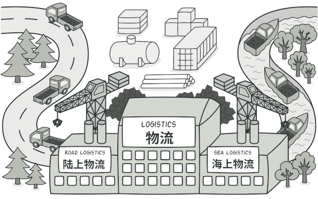

# 工厂方法模式

工厂方法模式是一种创建型设计模式， 其在父类中提供一个创建对象的方法， 允许子类决定实例化对象的类型。



## 问题

假设你正在开发一款物流管理应用。 最初版本只能处理卡车运输， 因此大部分代码都在位于名为 `卡车`的类中。一段时间后， 这款应用变得极受欢迎。 你每天都能收到十几次来自海运公司的请求， 希望应用能够支持海上物流功能。

目前， 大部分代码都与 `卡车`类相关。 在程序中添加 `轮船`类需要修改全部代码。 更糟糕的是， 如果你以后需要在程序中支持另外一种运输方式， 很可能需要再次对这些代码进行大幅修改。

最后， 你将不得不编写繁复的代码， 根据不同的运输对象类， 在应用中进行不同的处理。

## 解决方案

工厂方法模式建议使用特殊的工厂方法代替对于对象构造函数的直接调用 （即使用 `new`运算符）。 
工厂方法返回的对象通常被称作 “产品”。

乍看之下， 这种更改可能毫无意义： 我们只是改变了程序中调用构造函数的位置而已。 但是， 仔细想一下， 现在你可以在子类中重写工厂方法， 从而改变其创建产品的类型。

但有一点需要注意:仅当这些产品具有共同的基类或者接口时， 子类才能返回不同类型的产品， 同时基类中的工厂方法还应将其返回类型声明为这一共有接口。

## 工厂方法模式结构


- **产品** （Product） 将会对接口进行声明。 对于所有由创建者及其子类构建的对象， 这些接口都是通用的。
- **具体产品** （Concrete Products）是产品接口的不同实现。
- **创建者** （Creator） 类声明返回产品对象的工厂方法。 该方法的返回对象类型必须与产品接口相匹配。
  - 你可以将工厂方法声明为抽象方法， 强制要求每个子类以不同方式实现该方法。 或者，你也可以在基础工厂方法中返回默认产品类型。
  - 注意， 尽管它的名字是创建者， 但他最主要的职责并不是创建产品。 一般来说， 创建者类包含一些与产品相关的核心业务逻辑。工厂方法将这些逻辑处理从具体产品类中分离出来。 打个比方， 大型软件开发公司拥有程序员培训部门。 但是，这些公司的主要工作还是编写代码， 而非生产程序员。
- **具体创建者** （Concrete Creators） 将会重写基础工厂方法，使其返回不同类型的产品。
  - 注意， 并不一定每次调用工厂方法都会创建新的实例。 工厂方法也可以返回缓存、 对象池或其他来源的已有对象。

## 代码示例

```
//@ 汽车接口
class ICar
{
public:
	virtual string name() = 0;
	virtual ~ICar() = default;
};

//@ 奔驰汽车
class BenzCar : public ICar
{
public:
	virtual string name() override
	{
		return "Benz Car";
	}
};

//@ 宝马汽车
class BmwCar : public ICar
{
public:
	virtual string name() override
	{
		return "Bmw Car";
	}
};

//@ 工厂接口
class AFactory
{
public:
	virtual std::unique_ptr<ICar> CreateCar() = 0;
	virtual ~AFactory() = default;
};

//@ 奔驰工厂
class BenzFactory : public AFactory
{
public:
	std::unique_ptr<ICar> CreateCar() override
	{
		return std::make_unique<BenzCar>();
	}
};

//@ 宝马工厂
class BmwFactory : public AFactory
{
public:
	std::unique_ptr<ICar> CreateCar() override
	{
		return std::make_unique<BmwCar>();
	}
};

int main()
{
	std::unique_ptr<AFactory> pFactory = std::make_unique<BenzFactory>();
	std::unique_ptr<ICar> pCar = pFactory->CreateCar();
	std::cout << "Benz Factory Make Car: " << pCar->name() << std::endl;

	pFactory.reset(new BmwFactory());
	pCar.swap(pFactory->CreateCar());
	std::cout << "Bmw Factory Make Car: " << pCar->name() << std::endl;

	return 0;
}
```

## 工厂方法模式总结

### 实现方式

- 让所有产品都遵循同一接口。 该接口必须声明对所有产品都有意义的方法。
- 在创建类中添加一个空的工厂方法。 该方法的返回类型必须遵循通用的产品接口。
- 在创建者代码中找到对于产品构造函数的所有引用。 将它们依次替换为对于工厂方法的调用， 同时将创建产品的代码移入工厂方法。 你可能需要在工厂方法中添加临时参数来控制返回的产品类型。
- 为工厂方法中的每种产品编写一个创建者子类， 然后在子类中重写工厂方法， 并将基本方法中的相关创建代码移动到工厂方法中。
- 如果应用中的产品类型太多， 那么为每个产品创建子类并无太大必要， 这时你也可以在子类中复用基类中的控制参数。
- 如果代码经过上述移动后， 基础工厂方法中已经没有任何代码， 你可以将其转变为抽象类。 如果基础工厂方法中还有其他语句， 你可以将其设置为该方法的默认行为。

### 优点

- 可以避免创建者和具体产品之间的紧密耦合。
- 单一职责原则。 你可以将产品创建代码放在程序的单一位置， 从而使得代码更容易维护。
- 开闭原则。 无需更改现有客户端代码，你就可以在程序中引入新的产品类型。

### 缺点

- 应用工厂方法模式需要引入许多新的子类， 代码可能会因此变得更复杂。 最好的情况是将该模式引入创建者类的现有层次结构中。

### 适用场景

- 客户端不知道它所需要的对象的类。在工厂方法模式中，客户端不需要知道具体产品类的类名，只需要知道所对应的工厂即可，具体的产品对象由具体工厂类创建，可将具体工厂类的类名存储在配置文件或数据库中。
- 抽象工厂类通过其子类来指定创建哪个对象。在工厂方法模式中，对于抽象工厂类只需要提供一个创建产品的接口，而由其子类来确定具体要创建的对象，利用面向对象的多态性和里氏代换原则，在程序运行时，子类对象将覆盖父类对象，从而使得系统更容易扩展。


