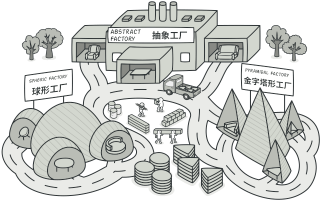

# 抽象工厂模式

抽象工厂模式是一种创建型设计模式， 它能创建一系列相关的对象， 而无需指定其具体类。



## 问题

假设你正在开发一款家具商店模拟器。 你的代码中包括一些类， 用于表示：

- 一系列相关产品， 例如 `椅子`Chair 、  `沙发`Sofa和 `咖啡桌`Coffee­Table 。
- 系列产品的不同变体。 例如， 你可以使用 `现代`Modern 、  `维多利亚`Victorian 、 `装饰风艺术`Art­Deco等风格生成 `椅子` 、  `沙发`和 `咖啡桌` 。


你需要设法单独生成每件家具对象， 这样才能确保其风格一致。 如果顾客收到的家具风格不一样， 他们可不会开心。

此外， 你也不希望在添加新产品或新风格时修改已有代码。 家具供应商对于产品目录的更新非常频繁， 你不会想在每次更新时都去修改核心代码的。

## 解决方案

首先， 抽象工厂模式建议为系列中的每件产品明确声明接口 （例如椅子、 沙发或咖啡桌）。然后， 确保所有产品变体都继承这些接口。 例如， 所有风格的椅子都实现 `椅子`接口； 所有风格的咖啡桌都实现 `咖啡桌`接口， 以此类推。

接下来， 我们需要声明**抽象工厂**——包含系列中所有产品构造方法的接口。 例如 `create­Chair`创建椅子 、  `create­Sofa`创建沙发和 `create­Coffee­Table`创建咖啡桌 。 这些方法必须返回**抽象**产品类型， 即我们之前抽取的那些接口：  `椅子` ，  `沙发`和 `咖啡桌`等等。

那么该如何处理产品变体呢？ 对于系列产品的每个变体， 我们都将基于 `抽象工厂`接口创建不同的工厂类。 每个工厂类都只能返回特定类别的产品， 例如，  `现代家具工厂`Modern­Furniture­Factory只能创建 `现代椅子`Modern­Chair 、  `现代沙发`Modern­Sofa和 `现代咖啡桌`Modern­Coffee­Table对象。

客户端代码可以通过相应的抽象接口调用工厂和产品类。 你无需修改实际客户端代码， 就能更改传递给客户端的工厂类， 也能更改客户端代码接收的产品变体。

## 抽象工厂模式结构


- **抽象产品** （Abstract Product） 为构成系列产品的一组不同但相关的产品声明接口。
- **具体产品** （Concrete Product） 是抽象产品的多种不同类型实现。 所有变体 （维多利亚/现代）都必须实现相应的抽象产品 （椅子/沙发）。
- **抽象工厂** （Abstract Factory）接口声明了一组创建各种抽象产品的方法。
- **具体工厂** （Concrete Factory） 实现抽象工厂的构建方法。 每个具体工厂都对应特定产品变体， 且仅创建此种产品变体。
- 尽管具体工厂会对具体产品进行初始化， 其构建方法签名必须返回相应的*抽象*产品。 这样，使用工厂类的客户端代码就不会与工厂创建的特定产品变体耦合。 **客户端** （Client） 只需通过抽象接口调用工厂和产品对象， 就能与任何具体工厂/产品变体交互。

## 代码示例

```
//@ 汽车接口
class ICar
{
public:
	virtual string name() = 0;
	virtual ~ICar() = default;
};

//@ 自行车接口
class IBike
{
public:
	virtual string name() = 0;
	virtual ~IBike() = default;
};

//@ 奔驰汽车
class BenzCar : public ICar
{
public:
	virtual string name() override
	{
		return "Benz Car";
	}
};

//@ 奔驰自行车
class BenzBike : public IBike
{
public:
	virtual string name() override
	{
		return "Benz Bike";
	}
};

//@ 宝马汽车
class BmwCar : public ICar
{
public:
	virtual string name() override
	{
		return "Bmw Car";
	}
};

//@ 宝马自行车
class BmwBike : public IBike
{
public:
	virtual string name() override
	{
		return "Bmw Bike";
	}
};

//@ 抽象工厂
class AFactory
{
public:
	enum FACTORY_TYPE
	{
		BENZ_FACTORY,
		BMW_FACTORY
	};

	virtual std::unique_ptr<ICar>  createCar() = 0;
	virtual std::unique_ptr<IBike> createBike() = 0;
	static std::unique_ptr<AFactory> createFactory(FACTORY_TYPE factory);
};

//@ 奔驰工厂
class BenzFactory : public AFactory
{
public:
	virtual std::unique_ptr<ICar>  createCar() override
	{
		return std::make_unique<BenzCar>();
	}
	virtual std::unique_ptr<IBike> createBike() override
	{
		return std::make_unique<BenzBike>();
	}
};

//@ 宝马工厂
class BmwFactory : public AFactory
{
public:
	virtual std::unique_ptr<ICar>  createCar() override
	{
		return std::make_unique<BmwCar>();
	}
	virtual std::unique_ptr<IBike> createBike() override
	{
		return std::make_unique<BmwBike>();
	}
};

std::unique_ptr<AFactory> AFactory::createFactory(FACTORY_TYPE factory)
{
	std::unique_ptr<AFactory> ret{ nullptr };
	switch (factory)
	{
	case FACTORY_TYPE::BENZ_FACTORY:
		ret.reset(new BenzFactory());
		break;
	case FACTORY_TYPE::BMW_FACTORY:
		ret.reset(new BmwFactory());
		break;
	default:
		break;;
	}
	return ret;
};

int main()
{
	std::unique_ptr<AFactory> pFactory = AFactory::createFactory(AFactory::BENZ_FACTORY);
	std::unique_ptr<ICar> pCar = pFactory->createCar();
	std::unique_ptr<IBike> pBike = pFactory->createBike();
	std::cout << "Benz Factory Make Car： " << pCar->name() << std::endl;
	std::cout << "Benz Factory Make Bike： " << pBike->name() << std::endl;

	pFactory.swap(AFactory::createFactory(AFactory::BMW_FACTORY));
	pCar.swap(pFactory->createCar());
	pBike.swap(pFactory->createBike());
	std::cout << "Bmw Factory Make Car： " << pCar->name() << std::endl;
	std::cout << "Bmw Factory Make Bike： " << pBike->name() << std::endl;

	return 0;
}
```

## 抽象工厂模式总结

抽象工厂模式是工厂方法模式的进一步延伸，由于它提供了功能更为强大的工厂类并且具备较好的可扩展性，在软件开发中得以广泛应用。

### 实现方式

- 以不同的产品类型与产品变体为维度绘制矩阵。
- 为所有产品声明抽象产品接口。 然后让所有具体产品类实现这些接口。
- 声明抽象工厂接口， 并且在接口中为所有抽象产品提供一组构建方法。
- 为每种产品变体实现一个具体工厂类。
- 在应用程序中开发初始化代码。 该代码根据应用程序配置或当前环境， 对特定具体工厂类进行初始化。 然后将该工厂对象传递给所有需要创建产品的类。
- 找出代码中所有对产品构造函数的直接调用， 将其替换为对工厂对象中相应构建方法的调用。

### 优点

- 可以确保同一工厂生成的产品相互匹配。
- 可以避免客户端和具体产品代码的耦合。
- 单一职责原则。 你可以将产品生成代码抽取到同一位置， 使得代码易于维护。
- 开闭原则。 向应用程序中引入新产品变体时， 你无需修改客户端代码。

### 缺点

- 增加新的产品等级结构麻烦，需要对原有系统进行较大的修改，甚至需要修改抽象层代码，这显然会带来较大的不便，违背了“开闭原则”。
- 由于采用该模式需要向应用中引入众多接口和类， 代码可能会比之前更加复杂。

### 适用场景

- 一个系统不应当依赖于产品类实例如何被创建、组合和表达的细节，这对于所有类型的工厂模式都是很重要的，用户无须关心对象的创建过程，将对象的创建和使用解耦。
- 系统中有多于一个的产品族，而每次只使用其中某一产品族。可以通过配置文件等方式来使得用户可以动态改变产品族，也可以很方便地增加新的产品族。
- 属于同一个产品族的产品将在一起使用，这一约束必须在系统的设计中体现出来。同一个产品族中的产品可以是没有任何关系的对象，但是它们都具有一些共同的约束，如同一操作系统下的按钮和文本框，按钮与文本框之间没有直接关系，但它们都是属于某一操作系统的，此时具有一个共同的约束条件：操作系统的类型。
- 产品等级结构稳定，设计完成之后，不会向系统中增加新的产品等级结构或者删除已有的产品等级结构。


