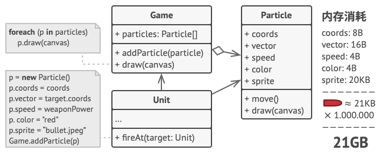
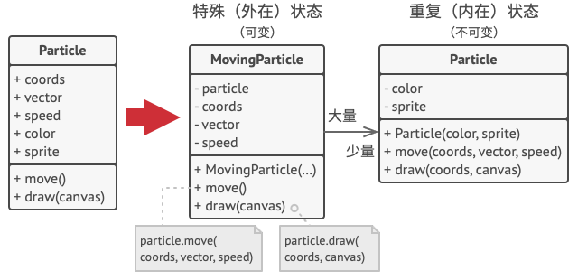
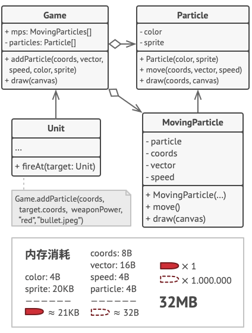
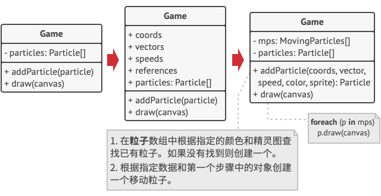

# 享元模式

享元模式是一种结构型设计模式， 它摒弃了在每个对象中保存所有数据的方式， 通过共享多个对象所共有的相同状态， 让你能在有限的内存容量中载入更多对象。


## 问题

假如你希望在长时间工作后放松一下， 所以开发了一款简单的游戏： 玩家们在地图上移动并相互射击。 你决定实现一个真实的粒子系统， 并将其作为游戏的特色。 大量的子弹、 导弹和爆炸弹片会在整个地图上穿行， 为玩家提供紧张刺激的游戏体验。

开发完成后， 你推送提交了最新版本的程序， 并在编译游戏后将其发送给了一个朋友进行测试。 尽管该游戏在你的电脑上完美运行， 但是你的朋友却无法长时间进行游戏： 游戏总是会在他的电脑上运行几分钟后崩溃。 在研究了几个小时的调试消息记录后， 你发现导致游戏崩溃的原因是内存容量不足。 朋友的设备性能远比不上你的电脑， 因此游戏运行在他的电脑上时很快就会出现问题。

真正的问题与粒子系统有关。 每个粒子 （一颗子弹、 一枚导弹或一块弹片） 都由包含完整数据的独立对象来表示。 当玩家在游戏中鏖战进入高潮后的某一时刻， 游戏将无法在剩余内存中载入新建粒子， 于是程序就崩溃了。



## 解决方案

仔细观察 `粒子`Particle类， 你可能会注意到颜色 （color） 和精灵图 （sprite） 这两个成员变量所消耗的内存要比其他变量多得多。 更糟糕的是， 对于所有的粒子来说， 这两个成员变量所存储的数据几乎完全一样 （比如所有子弹的颜色和精灵图都一样）。



每个粒子的另一些状态 （坐标、 移动矢量和速度） 则是不同的。 因为这些成员变量的数值会不断变化。 这些数据代表粒子在存续期间不断变化的情景， 但每个粒子的颜色和精灵图则会保持不变。

对象的常量数据通常被称为内在状态， 其位于对象中， 其他对象只能读取但不能修改其数值。 而对象的其他状态常常能被其他对象 “从外部” 改变， 因此被称为外在状态。

享元模式建议不在对象中存储外在状态， 而是将其传递给依赖于它的一个特殊方法。 程序只在对象中保存内在状态， 以方便在不同情景下重用。 这些对象的区别仅在于其内在状态 （与外在状态相比， 内在状态的变体要少很多）， 因此你所需的对象数量会大大削减。



让我们回到游戏中。 假如能从粒子类中抽出外在状态， 那么我们只需三个不同的对象 （子弹、 导弹和弹片） 就能表示游戏中的所有粒子。 你现在很可能已经猜到了， 我们将这样一个仅存储内在状态的对象称为享元。

### 外在状态存储

那么外在状态会被移动到什么地方呢？ 总得有类来存储它们， 对不对？ 在大部分情况中， 它们会被移动到容器对象中， 也就是我们应用享元模式前的聚合对象中。

在我们的例子中， 容器对象就是主要的 `游戏`Game对象， 其会将所有粒子存储在名为 `粒子`particles的成员变量中。 为了能将外在状态移动到这个类中， 你需要创建多个数组成员变量来存储每个粒子的坐标、 方向矢量和速度。 除此之外， 你还需要另一个数组来存储指向代表粒子的特定享元的引用。 这些数组必须保持同步， 这样你才能够使用同一索引来获取关于某个粒子的所有数据。



更优雅的解决方案是创建独立的情景类来存储外在状态和对享元对象的引用。 在该方法中， 容器类只需包含一个数组。

稍等！ 这样的话情景对象数量不是会和不采用该模式时的对象数量一样多吗？ 的确如此， 但这些对象要比之前小很多。 消耗内存最多的成员变量已经被移动到很少的几个享元对象中了。 现在， 一个享元大对象会被上千个情境小对象复用， 因此无需再重复存储数千个大对象的数据。

### 享元与不可变性

由于享元对象可在不同的情景中使用， 你必须确保其状态不能被修改。 享元类的状态只能由构造函数的参数进行一次性初始化， 它不能对其他对象公开其设置器或公有成员变量。

### 享元工厂

为了能更方便地访问各种享元， 你可以创建一个工厂方法来管理已有享元对象的缓存池。 工厂方法从客户端处接收目标享元对象的内在状态作为参数， 如果它能在缓存池中找到所需享元， 则将其返回给客户端； 如果没有找到， 它就会新建一个享元， 并将其添加到缓存池中。

你可以选择在程序的不同地方放入该函数。 最简单的选择就是将其放置在享元容器中。 除此之外， 你还可以新建一个工厂类， 或者创建一个静态的工厂方法并将其放入实际的享元类中。

##  享元模式结构


- 享元模式只是一种优化。 在应用该模式之前， 你要确定程序中存在与大量类似对象同时占用内存相关的内存消耗问题， 并且确保该问题无法使用其他更好的方式来解决。
- **享元** （Flyweight） 类包含原始对象中部分能在多个对象中共享的状态。 同一享元对象可在许多不同情景中使用。 享元中存储的状态被称为 “内在状态”。 传递给享元方法的状态被称为 “外在状态”。
- **情景** （Context） 类包含原始对象中各不相同的外在状态。 情景与享元对象组合在一起就能表示原始对象的全部状态。
- 通常情况下， 原始对象的行为会保留在享元类中。 因此调用享元方法必须提供部分外在状态作为参数。 但你也可将行为移动到情景类中， 然后将连入的享元作为单纯的数据对象。
- **客户端** （Client） 负责计算或存储享元的外在状态。 在客户端看来， 享元是一种可在运行时进行配置的模板对象， 具体的配置方式为向其方法中传入一些情景数据参数。
- **享元工厂** （Flyweight Factory） 会对已有享元的缓存池进行管理。 有了工厂后， 客户端就无需直接创建享元， 它们只需调用工厂并向其传递目标享元的一些内在状态即可。 工厂会根据参数在之前已创建的享元中进行查找， 如果找到满足条件的享元就将其返回； 如果没有找到就根据参数新建享元。

## 代码示例

```
//@ 玩家 - 有武器和使命
class IPlayer
{
public:
	virtual ~IPlayer() {}

	//@ 分配武器
	virtual void assignWeapon(std::string weapon) = 0;

	//@ 使命
	virtual void mission() = 0;

protected:
	std::string task_; //@ 内部状态
	std::string weapon_; //@ 外部状态
};

//@ 恐怖分子
class Terrorist : public IPlayer
{
public:
	Terrorist() 
	{
		task_ = "Plant a bomb";
	}

	virtual void assignWeapon(std::string weapon) override 
	{
		weapon_ = weapon;
	}

	virtual void mission() override 
	{
		std::cout << "Terrorist with weapon " + weapon_ + "," + " Task is " + task_ << std::endl;
	}
};

//@ 反恐精英
class CounterTerrorist : public IPlayer
{
public:
	CounterTerrorist() 
	{
		task_ = "Diffuse bomb";
	}

	virtual void assignWeapon(std::string weapon) override 
	{
		weapon_ = weapon;
	}

	virtual void mission() override 
	{
		std::cout << "Counter Terrorist with weapon " + weapon_ + "," + " Task is " + task_ << std::endl;
	}
};

//@ 用于获取玩家
class PlayerFactory
{
public:
	//@ 如果 T/CT 对象存在，则直接从享元池获取；否则，创建一个新对象并添加到享元池中，然后返回。
	static std::shared_ptr<IPlayer> getPlayer(std::string type)
	{
		std::shared_ptr<IPlayer> p{nullptr};
		if (map_.find(type) != map_.end()) {
			p = map_[type];
		}
		else 
		{
			//@ 创建 T/CT 对象
			if (type == "T") {
				std::cout << "Terrorist Created" << std::endl;
				p.reset(new Terrorist());
			}
			else if (type == "CT") {
				std::cout << "Counter Terrorist Created" << std::endl;
				p.reset(new CounterTerrorist());	
			}
			else {
				std::cout << "Unreachable code!" << std::endl;
			}
			//@ 一旦创建，将其插入到 map 中
			if(p != nullptr)
				map_.insert(std::make_pair(type, p));
		}
		return p;
	}

private:
	//@ 存储 T/CT 对象（享元池）
	static std::map<std::string, std::shared_ptr<IPlayer>> map_;
};


std::map<std::string, std::shared_ptr<IPlayer>> PlayerFactory::map_ = std::map<std::string, std::shared_ptr<IPlayer>>();

//@ 玩家类型和武器
static std::string s_playerType[2] = { "T", "CT" };
static std::string s_weapons[4] = { "AK-47", "Maverick", "Gut Knife", "Desert Eagle" };

#define GET_ARRAY_LEN(array, len) {len = (sizeof(array) / sizeof(array[0]));}

int main()
{
	srand((unsigned)time(NULL));

	int playerLen;
	int weaponsLen;
	GET_ARRAY_LEN(s_playerType, playerLen);
	GET_ARRAY_LEN(s_weapons, weaponsLen);

	//@ 假设，游戏中有十位玩家
	for (int i = 0; i < 10; i++) {
		//@ 获取随机玩家和武器
		int typeIndex = rand() % playerLen;
		int weaponIndex = rand() % weaponsLen;
		std::string type = s_playerType[typeIndex];
		std::string weapon = s_weapons[weaponIndex];

		//@ 获取玩家
		std::shared_ptr<IPlayer> p = PlayerFactory::getPlayer(type);

		//@ 从武器库中随机分配武器
		p->assignWeapon(weapon);

		//@ 派玩家去执行任务
		p->mission();
	}

	return 0;
}
```

## 享元模式总结

### 实现方式

- 将需要改写为享元的类成员变量拆分为两个部分：
  - 内在状态： 包含不变的、 可在许多对象中重复使用的数据的成员变量
  - 外在状态： 包含每个对象各自不同的情景数据的成员变量
- 保留类中表示内在状态的成员变量， 并将其属性设置为不可修改。 这些变量仅可在构造函数中获得初始数值。
- 找到所有使用外在状态成员变量的方法， 为在方法中所用的每个成员变量新建一个参数， 并使用该参数代替成员变量。
- 你可以有选择地创建工厂类来管理享元缓存池， 它负责在新建享元时检查已有的享元。 如果选择使用工厂， 客户端就只能通过工厂来请求享元， 它们需要将享元的内在状态作为参数传递给工厂。
- 客户端必须存储和计算外在状态 （情景） 的数值， 因为只有这样才能调用享元对象的方法。 为了使用方便， 外在状态和引用享元的成员变量可以移动到单独的情景类中。

### 优点

- 如果程序中有很多相似对象， 那么你将可以节省大量内存。

### 缺点

- 可能需要牺牲执行速度来换取内存， 因为他人每次调用享元方法时都需要重新计算部分情景数据。

- 代码会变得更加复杂。 团队中的新成员总是会问：  “为什么要像这样拆分一个实体的状态？”。

### 适用场景

- 一个系统有大量相同或者相似的对象，造成内存的大量耗费。
- 对象的大部分状态都可以外部化，可以将这些外部状态传入对象中。
- 在使用享元模式时需要维护一个存储享元对象的享元池，而这需要耗费一定的系统资源，因此，应当在需要多次重复使用享元对象时才值得使用享元模式。


