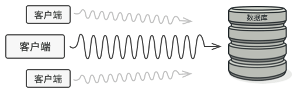
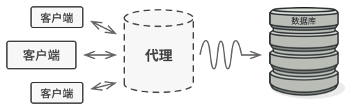

# 代理模式

代理模式是一种结构型设计模式， 让你能够提供对象的替代品或其占位符。 代理控制着对于原对象的访问， 并允许在将请求提交给对象前后进行一些处理。


##  问题

为什么要控制对于某个对象的访问呢？ 举个例子： 有这样一个消耗大量系统资源的巨型对象， 你只是偶尔需要使用它， 并非总是需要。



你可以实现延迟初始化： 在实际有需要时再创建该对象。 对象的所有客户端都要执行延迟初始代码。 不幸的是， 这很可能会带来很多重复代码。

在理想情况下， 我们希望将代码直接放入对象的类中， 但这并非总是能实现： 比如类可能是第三方封闭库的一部分。

##  解决方案

代理模式建议新建一个与原服务对象接口相同的代理类， 然后更新应用以将代理对象传递给所有原始对象客户端。 代理类接收到客户端请求后会创建实际的服务对象， 并将所有工作委派给它。



这有什么好处呢？ 如果需要在类的主要业务逻辑前后执行一些工作， 你无需修改类就能完成这项工作。 由于代理实现的接口与原类相同， 因此你可将其传递给任何一个使用实际服务对象的客户端。

## 代理模式结构


- **服务接口** （Service Interface） 声明了服务接口。 代理必须遵循该接口才能伪装成服务对象。
- **服务** （Service） 类提供了一些实用的业务逻辑。
- **代理** （Proxy） 类包含一个指向服务对象的引用成员变量。 代理完成其任务 （例如延迟初始化、 记录日志、 访问控制和缓存等） 后会将请求传递给服务对象。 通常情况下， 代理会对其服务对象的整个生命周期进行管理。
- **客户端** （Client） 能通过同一接口与服务或代理进行交互， 所以你可在一切需要服务对象的代码中使用代理。

## 真实世界类比


信用卡是银行账户的代理， 银行账户则是一大捆现金的代理。 它们都实现了同样的接口， 均可用于进行支付。 消费者会非常满意， 因为不必随身携带大量现金； 商店老板同样会十分高兴， 因为交易收入能以电子化的方式进入商店的银行账户中， 无需担心存款时出现现金丢失或被抢劫的情况。

## 代码示例

```
//@ 电信运营商
class ITelco
{
public:
	virtual ~ITelco() = default;
	virtual void Recharge(int money) = 0;
};

//@ 中国移动
class  CMCC : public ITelco
{
public:
	virtual void Recharge(int money) override
	{
		std::cout << "Recharge: " << money << std::endl;
	}
};

//@ 代理点
class Proxy : public ITelco
{
public:
	Proxy() { pCMCC_.reset(nullptr); }

	void Recharge(int money) override
	{
		//@ 低于 50 不充
		if (money >= 50)
		{
			if (pCMCC_ == nullptr)
				pCMCC_.reset(new CMCC());
			pCMCC_->Recharge(money);
		}
		else
		{
			std::cout << "Sorry, too little money" << std::endl;
		}
	}

private:
	std::unique_ptr<CMCC> pCMCC_;
};

int main()
{
	std::unique_ptr<Proxy> proxy(new Proxy());
	proxy->Recharge(30);
	proxy->Recharge(100);

	return 0;
}
```

## 代理模式总结

### 实现方式

- 如果没有现成的服务接口， 你就需要创建一个接口来实现代理和服务对象的可交换性。 从服务类中抽取接口并非总是可行的， 因为你需要对服务的所有客户端进行修改， 让它们使用接口。 备选计划是将代理作为服务类的子类， 这样代理就能继承服务的所有接口了。
- 创建代理类， 其中必须包含一个存储指向服务的引用的成员变量。 通常情况下， 代理负责创建服务并对其整个生命周期进行管理。 在一些特殊情况下， 客户端会通过构造函数将服务传递给代理。
- 根据需求实现代理方法。 在大部分情况下， 代理在完成一些任务后应将工作委派给服务对象。
- 可以考虑新建一个构建方法来判断客户端可获取的是代理还是实际服务。 你可以在代理类中创建一个简单的静态方法， 也可以创建一个完整的工厂方法。
- 可以考虑为服务对象实现延迟初始化。

### 优点

- 可以在客户端毫无察觉的情况下控制服务对象。
- 如果客户端对服务对象的生命周期没有特殊要求， 可以对生命周期进行管理。
- 即使服务对象还未准备好或不存在， 代理也可以正常工作。
- 开闭原则。 可以在不对服务或客户端做出修改的情况下创建新代理。

### 缺点

- 代码可能会变得复杂， 因为需要新建许多类。
-  服务响应可能会延迟。

### 适用场景

- 当客户端对象需要访问远程主机中的对象时可以使用远程代理。
- 当需要用一个消耗资源较少的对象来代表一个消耗资源较多的对象，从而降低系统开销、缩短运行时间时可以使用虚拟代理，例如一个对象需要很长时间才能完成加载时。
- 当需要为某一个被频繁访问的操作结果提供一个临时存储空间，以供多个客户端共享访问这些结果时可以使用缓冲代理。通过使用缓冲代理，系统无须在客户端每一次访问时都重新执行操作，只需直接从临时缓冲区获取操作结果即可。
- 当需要控制对一个对象的访问，为不同用户提供不同级别的访问权限时可以使用保护代理。
- 当需要为一个对象的访问（引用）提供一些额外的操作时可以使用智能引用代理。

