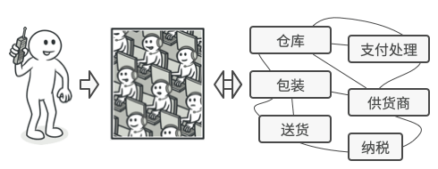

# 外观模式

外观模式是一种结构型设计模式， 能为程序库、 框架或其他复杂类提供一个简单的接口。


## 问题

假设你必须在代码中使用某个复杂的库或框架中的众多对象。 正常情况下， 你需要负责所有对象的初始化工作、 管理其依赖关系并按正确的顺序执行方法等。

最终， 程序中类的业务逻辑将与第三方类的实现细节紧密耦合， 使得理解和维护代码的工作很难进行。

## 解决方案

外观类为包含许多活动部件的复杂子系统提供一个简单的接口。 与直接调用子系统相比， 外观提供的功能可能比较有限， 但它却包含了客户端真正关心的功能。

如果你的程序需要与包含几十种功能的复杂库整合， 但只需使用其中非常少的功能， 那么使用外观模式会非常方便，例如， 上传猫咪搞笑短视频到社交媒体网站的应用可能会用到专业的视频转换库， 但它只需使用一个包含 `encode­(filename, format)`方法 （以文件名与文件格式为参数进行编码的方法） 的类即可。 在创建这个类并将其连接到视频转换库后， 你就拥有了自己的第一个外观。

## 外观模式结构


- **外观** （Facade） 提供了一种访问特定子系统功能的便捷方式， 其了解如何重定向客户端请求， 知晓如何操作一切活动部件。
- 创建**附加外观** （Additional Facade） 类可以避免多种不相关的功能污染单一外观， 使其变成又一个复杂结构。 客户端和其他外观都可使用附加外观。
- **复杂子系统** （Complex Subsystem） 由数十个不同对象构成。 如果要用这些对象完成有意义的工作， 你必须深入了解子系统的实现细节， 比如按照正确顺序初始化对象和为其提供正确格式的数据。
  - 子系统类不会意识到外观的存在， 它们在系统内运作并且相互之间可直接进行交互。
- **客户端** （Client） 使用外观代替对子系统对象的直接调用。

## 真实世界类比



当你通过电话给商店下达订单时， 接线员就是该商店的所有服务和部门的外观。 接线员为你提供了一个同购物系统、 支付网关和各种送货服务进行互动的简单语音接口。

## 代码示例

```
const std::string c_stateToStrCourier[] = { "收到", "验证可达性", "分配人员", "派送包裹", "获取交货确认", "完成" };
const std::string c_stateToStrVendor[] = { "收到", "确认库存", "从仓库得到物品", "包装", "联系快递员", "完成" };
const std::string c_stateToStrOrderTeam[] = { "收到", "确认付款", "联系供应商", "完成" };
const int c_nMsec = 300;  //@ 休眠时间（毫秒） - Sleep(c_nMsec) 处可以替换为一些有用的代码


//@ 订单团队
class OrderTeam
{
public:
	void submitRequest()
	{
		nState_ = 0;
	}

	bool checkStates()
	{
		std::cout << "订单团队 - 当前状态：" << c_stateToStrOrderTeam[nState_] << std::endl;
		std::this_thread::sleep_for(std::chrono::milliseconds(c_nMsec));
		nState_++;
		return nState_ == Complete;
	}

private:
	enum States
	{
		Received,	 //@ 收到
		VerifyPayment, //@ 确认付款
		ContractVender,	//@ 联系供应商
		Complete  //@ 完成
	};
	int nState_;
};

//@ 供应商
class Vendor
{
public:
	void submitRequest() 
	{
		nState_ = 0;
	}

	bool checkStatus() 
	{
		std::cout << "供应商 - 当前状态：" << c_stateToStrVendor[nState_] << std::endl;
		std::this_thread::sleep_for(std::chrono::milliseconds(c_nMsec));
		nState_++;
		return (nState_ == Complete);
	}

private:
	enum States {
		Received,  //@ 收到
		VerifyInventory,  //@ 确认库存
		GetItemFromWareHouse,  //@ 从仓库得到物品
		PackItem,  //@ 包装
		ContactCourier,  //@ 联系快递员
		Complete  //@ 完成
	};
	int nState_;
};

//@ 快递员
class Courier
{
public:
	//@ 将请求转发给快递员
	void submitRequest() 
	{
		nState_ = 0;
	}

	bool checkStatus() {
		std::cout << "快递员 - 当前状态：" << c_stateToStrCourier[nState_] << std::endl;
		std::this_thread::sleep_for(std::chrono::milliseconds(c_nMsec));
		nState_++;
		return (nState_ == Complete);
	}

private:
	enum States {
		Received,  //@ 收到
		VerifyReachbility,  //@ 验证可达性
		AssignPerson,  //@ 分配人员
		DispatchPackage,  //@ 派送包裹
		GetDeliveryConfirmation,  //@ 获取交货确认
		Complete  //@ 完成
	};
	int nState_;
};

//@ 网购外观
class OnlineShoppingFacade
{
public:
	OnlineShoppingFacade() :nCount_(0) {}

	//@ 返回跟踪次数
	int followupNum() 
	{
		return nCount_;
	}

	//@ 提交订单
	void submitRequest() 
	{
		nState_ = 0;
	}

	//@ 跟踪订单
	bool checkStatus()
	{
		switch (nState_)
		{
		case Received:
			nState_++;
			//@ 将请求转发给订单团队
			order_.submitRequest();
			std::cout << "********** 提交给订单团队，跟踪次数：" << nCount_ << " **********" << std::endl;
			break;
		case SubmittedToOrderTeam:
			//@ 如果订单团队完成验证，则向供应商发出请求
			if (order_.checkStates())
			{
				nState_++;
				vendor_.submitRequest();
				std::cout << "********** 提交给供应商，跟踪次数：" << nCount_ << " **********" << std::endl;
			}
			break;
		case SubmittedToVendor:
			//@ 如果供应商已将包裹打包，将其转发给快递员
			if (vendor_.checkStatus()) {
				nState_++;
				courier_.submitRequest();
				std::cout << "********** 提交给快递员，跟踪次数：" << nCount_ << " **********" << std::endl;
			}
			break;
		case SubmittedToCourier:
			//@ 如果包裹交付，订单完成
			if (courier_.checkStatus())
				return true;
		default:
			break;
		}

		nCount_++;

		//@ 订单未完成
		return false;
	}

private:
	enum States {
		Received,  //@ 收到
		SubmittedToOrderTeam,  //@ 提交给订单团队
		SubmittedToVendor,  //@ 提交给供应商
		SubmittedToCourier  //@ 提交给快递员
	};

	int nState_;  //@ 订单状态
	int nCount_;  //@ 跟踪次数

	OrderTeam order_;
	Vendor vendor_;
	Courier courier_;
};

int main()
{
	OnlineShoppingFacade facade;
	//@ 提交订单
	facade.submitRequest();
	//@ 跟踪订单，直到订单完成
	while (!facade.checkStatus());

	std::cout << "********** 订单完成，跟踪次数：" << facade.followupNum() << " **********" << std::endl;

	return 0;
}
```

## 外观模式总结

### 实现方式

- 考虑能否在现有子系统的基础上提供一个更简单的接口。 如果该接口能让客户端代码独立于众多子系统类， 那么你的方向就是正确的。
- 在一个新的外观类中声明并实现该接口。 外观应将客户端代码的调用重定向到子系统中的相应对象处。 如果客户端代码没有对子系统进行初始化， 也没有对其后续生命周期进行管理， 那么外观必须完成此类工作。
- 如果要充分发挥这一模式的优势， 你必须确保所有客户端代码仅通过外观来与子系统进行交互。 此后客户端代码将不会受到任何由子系统代码修改而造成的影响， 比如子系统升级后， 你只需修改外观中的代码即可。
- 如果外观变得过于臃肿， 你可以考虑将其部分行为抽取为一个新的专用外观类。

### 优点

- 可以让自己的代码独立于复杂子系统。

### 缺点

- 外观可能成为与程序中所有类都耦合的上帝对象。 

### 适用场景

- 当要为访问一系列复杂的子系统提供一个简单入口时可以使用外观模式。
- 客户端程序与多个子系统之间存在很大的依赖性。引入外观类可以将子系统与客户端解耦，从而提高子系统的独立性和可移植性。
-  在层次化结构中，可以使用外观模式定义系统中每一层的入口，层与层之间不直接产生联系，而通过外观类建立联系，降低层之间的耦合度。


