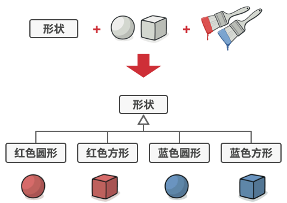

# 桥接模式

桥接模式是一种结构型设计模式， 可将一个大类或一系列紧密相关的类拆分为抽象和实现两个独立的层次结构， 从而能在开发时分别使用。


## 问题

假如你有一个几何 `形状`Shape类， 从它能扩展出两个子类：  `圆形`Circle和 `方形`Square 。 你希望对这样的类层次结构进行扩展以使其包含颜色， 所以你打算创建名为 `红色`Red和 `蓝色`Blue的形状子类。 但是， 由于你已有两个子类， 所以总共需要创建四个类才能覆盖所有组合， 例如 `蓝色圆形`Blue­Circle和 `红色方形`Red­Square 。



在层次结构中新增形状和颜色将导致代码复杂程度指数增长。 例如添加三角形状， 你需要新增两个子类， 也就是每种颜色一个； 此后新增一种新颜色需要新增三个子类， 即每种形状一个。 如此以往， 情况会越来越糟糕。

## 解决方案

问题的根本原因是我们试图在两个独立的维度——形状与颜色——上扩展形状类。 这在处理类继承时是很常见的问题。

桥接模式通过将继承改为组合的方式来解决这个问题。 具体来说， 就是抽取其中一个维度并使之成为独立的类层次， 这样就可以在初始类中引用这个新层次的对象， 从而使得一个类不必拥有所有的状态和行为。


根据该方法， 我们可以将颜色相关的代码抽取到拥有 `红色`和 `蓝色`两个子类的颜色类中，然后在 `形状`类中添加一个指向某一颜色对象的引用成员变量。 现在， 形状类可以将所有与颜色相关的工作委派给连入的颜色对象。 这样的引用就成为了 `形状`和 `颜色`之间的桥梁。此后， 新增颜色将不再需要修改形状的类层次， 反之亦然。

## 桥接模式结构


- **抽象部分** （Abstraction）提供高层控制逻辑， 依赖于完成底层实际工作的实现对象。

- **实现部分** （Implementation）为所有具体实现声明通用接口。 抽象部分仅能通过在这里声明的方法与实现对象交互。

  - 抽象部分可以列出和实现部分一样的方法， 但是抽象部分通常声明一些复杂行为，这些行为依赖于多种由实现部分声明的原语操作。

- **具体实现** （Concrete Implementations） 中包括特定于平台的代码。
  
- **精确抽象** （Refined Abstraction）提供控制逻辑的变体。 与其父类一样， 它们通过通用实现接口与不同的实现进行交互。
  
- 通常情况下， **客户端** （Client） 仅关心如何与抽象部分合作。 但是， 客户端需要将抽象对象与一个实现对象连接起来。
  

## 代码示例

```
//@ 电器类
class IElectricalEquipment
{
public:
	virtual ~IElectricalEquipment() = default;

	//@ 打开
	virtual void powerOn() = 0;
	//@ 关闭
	virtual void powerOff() = 0;
};

//@ 电灯
class Light : public IElectricalEquipment
{
public:
	//@ 开灯
	virtual void powerOn() override
	{
		std::cout << "Light is on." << std::endl;
	}

	//@ 关灯
	virtual void powerOff() override
	{
		std::cout << "Light is off." << std::endl;
	}
};

//@ 风扇
class Fan : public IElectricalEquipment
{
public:
	//@ 打开风扇
	virtual void powerOn() override 
	{
		std::cout << "Fan is on." << std::endl;
	}

	//@ 关闭风扇
	virtual void powerOff() override 
	{
		std::cout << "Fan is off." << std::endl;
	}
};

//@ 开关
class ISwitch
{
public:
	ISwitch(std::shared_ptr<IElectricalEquipment>& ee) { pEe_.swap(ee); }
	virtual ~ISwitch() {}

	//@ 打开电器
	virtual void on() = 0;
	//@ 关闭电器
	virtual void off() = 0;

protected:
	std::shared_ptr<IElectricalEquipment> pEe_;
};

//@ 拉链式开关
class PullChainSwitch : public ISwitch
{
public:
	PullChainSwitch(std::shared_ptr<IElectricalEquipment>& ee) : ISwitch(ee) {}

	//@ 用拉链式开关打开电器 
	virtual void on()override
	{
		std::cout << "Switch on the equipment with a pull chain switch." << std::endl;
		pEe_->powerOn();
	}

	//@ 用拉链式开关关闭电器
	virtual void off() override
	{
		std::cout << "Switch off the equipment with a pull chain switch." << std::endl;
		pEe_->powerOff();
	}
};

//@ 两位开关
class TwoPositionSwitch : public ISwitch
{
public:
	TwoPositionSwitch(std::shared_ptr<IElectricalEquipment>& ee) : ISwitch(ee) {}

	//@ 用两位开关打开电器
	virtual void on() override 
	{
		std::cout << "Switch on the equipment with a two-position switch." << std::endl;
		pEe_->powerOn();
	}

	//@ 用两位开关关闭电器
	virtual void off() override
	{
		std::cout << "Switch off the equipment with a two-position switch." << std::endl;
		pEe_->powerOff();
	}
};

int main()
{
	//@ 创建电器 - 电灯、风扇
	std::shared_ptr<IElectricalEquipment> light(new Light());
	std::shared_ptr<IElectricalEquipment> fan(new Fan());


	/**
	* 创建开关 - 拉链式开关、两位开关
	* 将拉链式开关和电灯关联起来，将两位开关和风扇关联起来
	**/
	std::unique_ptr<ISwitch> pullChain(new PullChainSwitch(light));
	std::unique_ptr<ISwitch> twoPosition(new TwoPositionSwitch(fan));

	//@ 开灯、关灯
	pullChain->on();
	pullChain->off();

	//@ 打开风扇、关闭风扇
	twoPosition->on();
	twoPosition->off();

	return 0;
}
```

## 桥接模式总价

### 实现方式

- 明确类中独立的维度。 独立的概念可能是： 抽象/平台， 域/基础设施， 前端/后端或接口/实现。
- 了解客户端的业务需求， 并在抽象基类中定义它们。
- 确定在所有平台上都可执行的业务。 并在通用实现接口中声明抽象部分所需的业务。
- 为你域内的所有平台创建实现类， 但需确保它们遵循实现部分的接口。
- 在抽象类中添加指向实现类型的引用成员变量。 抽象部分会将大部分工作委派给该成员变量所指向的实现对象。
- 如果你的高层逻辑有多个变体， 则可通过扩展抽象基类为每个变体创建一个精确抽象。
- 客户端代码必须将实现对象传递给抽象部分的构造函数才能使其能够相互关联。 此后， 客户端只需与抽象对象进行交互， 无需和实现对象打交道。

### 优点

- 可以创建与平台无关的类和程序。
-  客户端代码仅与高层抽象部分进行互动，不会接触到平台的详细信息。
- 开闭原则。 你可以新增抽象部分和实现部分， 且它们之间不会相互影响。
- 单一职责原则。 抽象部分专注于处理高层逻辑， 实现部分处理平台细节。

### 缺点

- 对高内聚的类使用该模式可能会让代码更加复杂。

### 适用场景

- 如果一个系统需要在抽象化和具体化之间增加更多的灵活性，避免在两个层次之间建立静态的继承关系，通过桥接模式可以使它们在抽象层建立一个关联关系。
- “抽象部分”和“实现部分”可以以继承的方式独立扩展而互不影响，在程序运行时可以动态将一个抽象化子类的对象和一个实现化子类的对象进行组合，即系统需要对抽象化角色和实现化角色进行动态耦合。
- 一个类存在两个（或多个）独立变化的维度，且这两个（或多个）维度都需要独立进行扩展。
- 对于那些不希望使用继承或因为多层继承导致系统类的个数急剧增加的系统，桥接模式尤为适用。


  


