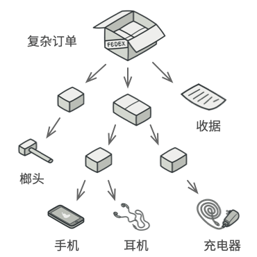
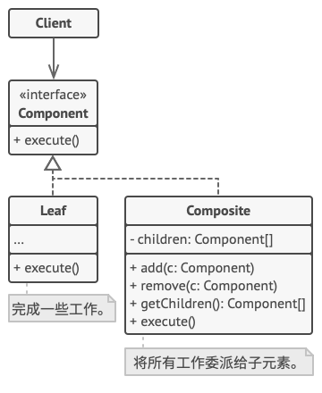

# 组合模式

组合模式是一种结构型设计模式， 你可以使用它将对象组合成树状结构， 并且能像使用独立对象一样使用它们。


## 问题

如果应用的核心模型能用树状结构表示， 在应用中使用组合模式才有价值。

例如， 你有两类对象：  `产品`和 `盒子` 。 一个盒子中可以包含多个 `产品`或者几个较小的 `盒子` 。 这些小 `盒子`中同样可以包含一些 `产品`或更小的 `盒子` ， 以此类推。

假设你希望在这些类的基础上开发一个定购系统。 订单中可以包含无包装的简单产品， 也可以包含装满产品的盒子……以及其他盒子。 此时你会如何计算每张订单的总价格呢？




你可以尝试直接计算： 打开所有盒子， 找到每件产品， 然后计算总价。 这在真实世界中或许可行， 但在程序中， 你并不能简单地使用循环语句来完成该工作。 你必须事先知道所有 `产品`和 `盒子`的类别， 所有盒子的嵌套层数以及其他繁杂的细节信息。 因此， 直接计算极不方便， 甚至完全不可行。

##  解决方案

那么方法该如何设计呢？ 对于一个产品， 该方法直接返回其价格； 对于一个盒子， 该方法遍历盒子中的所有项目， 询问每个项目的价格， 然后返回该盒子的总价格。 如果其中某个项目是小一号的盒子， 那么当前盒子也会遍历其中的所有项目， 以此类推， 直到计算出所有内部组成部分的价格。 你甚至可以在盒子的最终价格中增加额外费用， 作为该盒子的包装费用。


该方式的最大优点在于你无需了解构成树状结构的对象的具体类。 你也无需了解对象是简单的产品还是复杂的盒子。 你只需调用通用接口以相同的方式对其进行处理即可。 当你调用该方法后， 对象会将请求沿着树结构传递下去。

## 组合模式结构



- **组件** （Component） 接口描述了树中简单项目和复杂项目所共有的操作。
- **叶节点** （Leaf） 是树的基本结构， 它不包含子项目。
  - 一般情况下， 叶节点最终会完成大部分的实际工作， 因为它们无法将工作指派给其他部分。
- **容器** （Container）——又名 “组合（Composite）”——是包含叶节点或其他容器等子项目的单位。 容器不知道其子项目所属的具体类， 它只通过通用的组件接口与其子项目交互。
  - 容器接收到请求后会将工作分配给自己的子项目， 处理中间结果， 然后将最终结果返回给客户端。
- **客户端** （Client） 通过组件接口与所有项目交互。因此， 客户端能以相同方式与树状结构中的简单或复杂项目交互。

##  真实世界类比


大部分国家的军队都采用层次结构管理。 每支部队包括几个师， 师由旅构成， 旅由团构成，团可以继续划分为排。 最后， 每个排由一小队实实在在的士兵组成。 军事命令由最高层下达， 通过每个层级传递， 直到每位士兵都知道自己应该服从的命令。

## 代码示例

```
class Component
{
public:
	Component(string name) : strName_(name) {}
	virtual ~Component() {}
	virtual void add(std::shared_ptr<Component> cmpt) = 0;  //@ 添加构件
	virtual void remove(std::shared_ptr<Component> cmpt) = 0;  //@ 删除构件
	virtual std::shared_ptr<Component> getChild(int index) = 0;  //@ 获取构件
	virtual void operation(int indent) = 0;  //@ 显示构件（以缩进的方式）

private:
	Component();  //@ 不允许外部构造

protected:
	string strName_;
};

class Leaf : public Component
{
public:
	Leaf(string name) : Component(name) {}
	virtual ~Leaf() {}

	virtual void add(std::shared_ptr<Component> cmpt) override
	{
		cout << "Can't add to a Leaf" << endl;
	}

	virtual void remove(std::shared_ptr<Component> cmpt) override
	{
		cout << "Can't remove from a Leaf" << endl;
	}

	virtual std::shared_ptr<Component> getChild(int index) override
	{
		cout << "Can't get child from a Leaf" << endl;
		return NULL;
	}

	virtual void operation(int indent) override 
	{
		string newStr(indent, '-');
		cout << newStr << " " << strName_ << endl;
	}

private:
	Leaf();  //@ 不允许外部构造
};

class Composite : public Component
{
public:
	Composite(string name) : Component(name) {}

	virtual void add(std::shared_ptr<Component> cmpt) override
	{
		elements_.push_back(cmpt);
	}

	virtual void remove(std::shared_ptr<Component> cmpt) override
	{
		vector<std::shared_ptr<Component>>::iterator it = elements_.begin();
		while (it != elements_.end()) 
		{
			if (*it == cmpt)
			{		
				elements_.erase(it);
				break;
			}
			++it;
		}
	}

	virtual std::shared_ptr<Component> getChild(int index) override
	{
		if (index >= elements_.size())
			return NULL;

		return elements_[index];
	}

	//@ 递归显示
	virtual void operation(int indent) override 
	{
		string newStr(indent, '-');
		cout << newStr << "+ " << strName_ << endl;
		//@ 显示每个节点的孩子
		vector<std::shared_ptr<Component>>::iterator it = elements_.begin();
		while (it != elements_.end()) 
		{
			(*it)->operation(indent + 2);
			++it;
		}
	}

private:
	Composite();   //@ 不允许外部构造

private:
	vector<std::shared_ptr<Component>> elements_;
};


int main()
{
	////@ 创建一个树形结构
	//@ 创建根节点
	std::shared_ptr<Component> pRoot(new Composite("江湖公司（任我行）"));

	//@ 创建分支
	std::shared_ptr<Component> pDepart1(new Composite("日月神教（东方不败）"));
	pDepart1->add(std::make_shared<Leaf>(Leaf("光明左使（向问天）")));
	pDepart1->add(std::make_shared<Leaf>(Leaf("光明右使（曲洋）")));
	pRoot->add(pDepart1);

	std::shared_ptr<Component> pDepart2(new Composite("五岳剑派（左冷蝉）"));
	pDepart2->add(std::make_shared<Leaf>(Leaf("嵩山（左冷蝉）")));
	pDepart2->add(std::make_shared<Leaf>(Leaf("衡山（莫大）")));
	pDepart2->add(std::make_shared<Leaf>(Leaf("华山（岳不群）")));
	pDepart2->add(std::make_shared<Leaf>(Leaf("泰山（天门道长）")));
	pDepart2->add(std::make_shared<Leaf>(Leaf("恒山（定闲师太）")));
	pRoot->add(pDepart2);

	//@ 添加和删除叶子
	pRoot->add(std::make_shared<Leaf>(Leaf("少林（方证大师）")));
	pRoot->add(std::make_shared<Leaf>(Leaf("武当（冲虚道长）")));
	std::shared_ptr<Component> pLeaf(new Leaf("青城（余沧海）"));
	pRoot->add(pLeaf);

	//@ 小丑，直接裁掉
	pRoot->remove(pLeaf);

	//@ 递归地显示组织架构
	pRoot->operation(1);

	return 0;
}
```

## 组合模式总结

### 实现方式

- 确保应用的核心模型能够以树状结构表示。 尝试将其分解为简单元素和容器。 记住， 容器必须能够同时包含简单元素和其他容器。
- 声明组件接口及其一系列方法， 这些方法对简单和复杂元素都有意义。
- 创建一个叶节点类表示简单元素。 程序中可以有多个不同的叶节点类。
- 创建一个容器类表示复杂元素。 在该类中， 创建一个数组成员变量来存储对于其子元素的引用。 该数组必须能够同时保存叶节点和容器， 因此请确保将其声明为组合接口类型。
  - 实现组件接口方法时， 记住容器应该将大部分工作交给其子元素来完成。
- 最后， 在容器中定义添加和删除子元素的方法。
  - 记住， 这些操作可在组件接口中声明。 这将会违反接口隔离原则， 因为叶节点类中的这些方法为空。 但是， 这可以让客户端无差别地访问所有元素， 即使是组成树状结构的元素。

### 优点

- 可以利用多态和递归机制更方便地使用复杂树结构。
- 开闭原则。 无需更改现有代码， 你就可以在应用中添加新元素， 使其成为对象树的一部分。

### 缺点

- 对于功能差异较大的类， 提供公共接口或许会有困难。 在特定情况下， 你需要过度一般化组件接口， 使其变得令人难以理解。

### 适用场景

- 在具有整体和部分的层次结构中，希望通过一种方式忽略整体与部分的差异，客户端可以一致地对待它们。
- 在一个使用面向对象语言开发的系统中需要处理一个树形结构。
- 在一个系统中能够分离出叶子对象和容器对象，而且它们的类型不固定，需要增加一些新的类型。