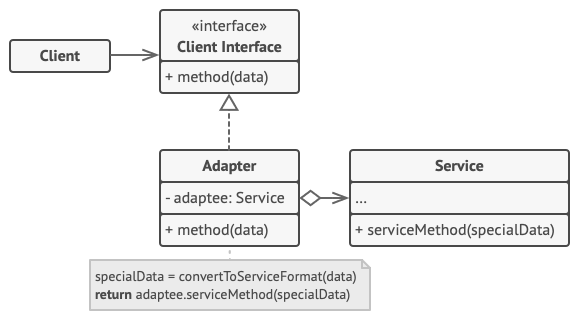

# 适配器模式

适配器模式是一种结构型设计模式， 它能使接口不兼容的对象能够相互合作。


##  问题

假如你正在开发一款股票市场监测程序， 它会从不同来源下载 XML 格式的股票数据， 然后向用户呈现出美观的图表。

在开发过程中， 你决定在程序中整合一个第三方智能分析函数库。 但是遇到了一个问题， 那就是分析函数库只兼容 JSON 格式的数据。

你可以修改程序库来支持 XML。 但是， 这可能需要修改部分依赖该程序库的现有代码。 甚至还有更糟糕的情况， 你可能根本没有程序库的源代码， 从而无法对其进行修改。


## 解决方案

你可以创建一个**适配器**。 这是一个特殊的对象， 能够转换对象接口， 使其能与其他对象进行交互。

适配器模式通过封装对象将复杂的转换过程隐藏于幕后。 被封装的对象甚至察觉不到适配器的存在。 例如， 你可以使用一个将所有数据转换为英制单位 （如英尺和英里） 的适配器封装运行于米和千米单位制中的对象。

适配器不仅可以转换不同格式的数据， 其还有助于采用不同接口的对象之间的合作。 它的运作方式如下：

- 适配器实现与其中一个现有对象兼容的接口。
- 现有对象可以使用该接口安全地调用适配器方法。
- 适配器方法被调用后将以另一个对象兼容的格式和顺序将请求传递给该对象。

有时你甚至可以创建一个双向适配器来实现双向转换调用。


让我们回到股票市场程序。 为了解决数据格式不兼容的问题， 你可以为分析函数库中的每个类创建将 XML 转换为 JSON 格式的适配器， 然后让客户端仅通过这些适配器来与函数库进行交流。 当某个适配器被调用时， 它会将传入的 XML 数据转换为 JSON 结构， 并将其传递给被封装分析对象的相应方法。

## 适配器模式结构



- **客户端** （Client）是包含当前程序业务逻辑的类。
- **客户端接口** （Client Interface）描述了其他类与客户端代码合作时必须遵循的协议。
- **服务** （Service） 中有一些功能类（通常来自第三方或遗留系统）。客户端与其接口不兼容， 因此无法直接调用其功能。
- **适配器** （Adapter） 是一个可以同时与客户端和服务交互的类： 它在实现客户端接口的同时封装了服务对象。 适配器接受客户端通过适配器接口发起的调用， 并将其转换为适用于被封装服务对象的调用。
- 客户端代码只需通过接口与适配器交互即可， 无需与具体的适配器类耦合。 因此， 你可以向程序中添加新类型的适配器而无需修改已有代码。 这在服务类的接口被更改或替换时很有用： 你无需修改客户端代码就可以创建新的适配器类。

## 真实世界类比


如果你是第一次从美国到欧洲旅行， 那么在给笔记本充电时可能会大吃一惊。 不同国家的电源插头和插座标准不同。 美国插头和德国插座不匹配。 同时提供美国标准插座和欧洲标准插头的电源适配器可以解决你的难题。

## 代码示例

```
//@ 自带的充电器-两脚扁型
class OwnCharger
{
public:
	void chargeWithFeetFlat()
	{
		std::cout << "OwnCharger::chargeWithFeetFlat" << std::endl;
	}
};

//@ 俄罗斯提供的插座
class IRussiaSocket
{
public:
	//@ 使用双脚圆形充电
	virtual void charge() = 0;
	virtual ~IRussiaSocket() = default;
};

class PowerAdapter : public IRussiaSocket
{
public:
	PowerAdapter() { pCharger_.reset(new OwnCharger()); }
	virtual void charge() override
	{
		pCharger_->chargeWithFeetFlat();
	}

private:
	//@ 持有需要被适配的接口对象 - 自带的充电器
	std::unique_ptr<OwnCharger> pCharger_; 
};

int main()
{
	//@ 创建适配器
	std::unique_ptr<IRussiaSocket> pAdapter(new PowerAdapter());
	
	//@ 充电
	pAdapter->charge();

	return 0;
}
```

## 适配器模式总结

### 实现方式

- 确保至少有两个类的接口不兼容：
  - 一个无法修改 （通常是第三方、 遗留系统或者存在众多已有依赖的类） 的功能性服务类。
  - 一个或多个将受益于使用服务类的客户端类。
- 声明客户端接口， 描述客户端如何与服务交互。
- 创建遵循客户端接口的适配器类。 所有方法暂时都为空。
- 在适配器类中添加一个成员变量用于保存对于服务对象的引用。 通常情况下会通过构造函数对该成员变量进行初始化， 但有时在调用其方法时将该变量传递给适配器会更方便。
- 依次实现适配器类客户端接口的所有方法。 适配器会将实际工作委派给服务对象， 自身只负责接口或数据格式的转换。
- 客户端必须通过客户端接口使用适配器。 这样一来， 你就可以在不影响客户端代码的情况下修改或扩展适配器。

### 优点

- 单一职责原则，可以将接口或数据转换代码从程序主要业务逻辑中分离。
- 开闭原则。 只要客户端代码通过客户端接口与适配器进行交互， 你就能在不修改现有客户端代码的情况下在程序中添加新类型的适配器。

### 缺点

- 代码整体复杂度增加， 因为你需要新增一系列接口和类。 有时直接更改服务类使其与其他代码兼容会更简单。

### 适用场景

- 系统需要使用一些现有的类，而这些类的接口（如方法名）不符合系统的需要，甚至没有这些类的源代码。
- 想创建一个可以重复使用的类，用于与一些彼此之间没有太大关联的一些类，包括一些可能在将来引进的类一起工作。


