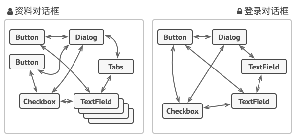
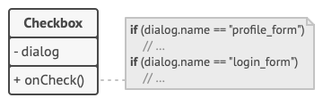
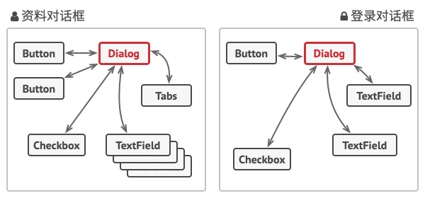

# 中介者模式

中介者模式是一种行为设计模式， 能让你减少对象之间混乱无序的依赖关系。 该模式会限制对象之间的直接交互， 迫使它们通过一个中介者对象进行合作。


## 问题

假如你有一个创建和修改客户资料的对话框， 它由各种控件组成， 例如文本框 （Text­Field）、复选框 （Checkbox） 和按钮 （Button） 等。



某些表单元素可能会直接进行互动。 例如， 选中 “我有一只狗” 复选框后可能会显示一个隐藏文本框用于输入狗狗的名字。 另一个例子是提交按钮必须在保存数据前校验所有输入内容。



如果直接在表单元素代码中实现业务逻辑， 你将很难在程序其他表单中复用这些元素类。 例如， 由于复选框类与狗狗的文本框相耦合， 所以将无法在其他表单中使用它。 你要么使用渲染资料表单时用到的所有类， 要么一个都不用。

## 解决方案

中介者模式建议你停止组件之间的直接交流并使其相互独立。 这些组件必须调用特殊的中介者对象， 通过中介者对象重定向调用行为， 以间接的方式进行合作。 最终， 组件仅依赖于一个中介者类， 无需与多个其他组件相耦合。

在资料编辑表单的例子中， 对话框 （Dialog） 类本身将作为中介者， 其很可能已知自己所有的子元素， 因此你甚至无需在该类中引入新的依赖关系。



绝大部分重要的修改都在实际表单元素中进行。 让我们想想提交按钮。 之前， 当用户点击按钮后， 它必须对所有表单元素数值进行校验。 而现在它的唯一工作是将点击事件通知给对话框。 收到通知后， 对话框可以自行校验数值或将任务委派给各元素。 这样一来， 按钮不再与多个表单元素相关联， 而仅依赖于对话框类。

你还可以为所有类型的对话框抽取通用接口， 进一步削弱其依赖性。 接口中将声明一个所有表单元素都能使用的通知方法， 可用于将元素中发生的事件通知给对话框。 这样一来， 所有实现了该接口的对话框都能使用这个提交按钮了。

采用这种方式， 中介者模式让你能在单个中介者对象中封装多个对象间的复杂关系网。 类所拥有的依赖关系越少， 就越易于修改、 扩展或复用。

## 中介者模式结构


- **组件** （Component） 是各种包含业务逻辑的类。 每个组件都有一个指向中介者的引用， 该引用被声明为中介者接口类型。 组件不知道中介者实际所属的类，因此你可通过将其连接到不同的中介者以使其能在其他程序中复用。
- **中介者** （Mediator） 接口声明了与组件交流的方法， 但通常仅包括一个通知方法。 组件可将任意上下文 （包括自己的对象） 作为该方法的参数，只有这样接收组件和发送者类之间才不会耦合。
- **具体中介者** （Concrete Mediator） 封装了多种组件间的关系。 具体中介者通常会保存所有组件的引用并对其进行管理， 甚至有时会对其生命周期进行管理。
- 组件并不知道其他组件的情况。 如果组件内发生了重要事件， 它只能通知中介者。 中介者收到通知后能轻易地确定发送者， 这或许已足以判断接下来需要触发的组件了。
  - 对于组件来说， 中介者看上去完全就是一个黑箱。 发送者不知道最终会由谁来处理自己的请求， 接收者也不知道最初是谁发出了请求。

## 真实世界类比


飞行器驾驶员们在靠近或离开空中管制区域时不会直接相互交流。 但他们会与飞机跑道附近，塔台中的空管员通话。 如果没有空管员， 驾驶员就需要留意机场附近的所有飞机， 并与数十位飞行员组成的委员会讨论降落顺序。 那恐怕会让飞机坠毁的统计数据一飞冲天吧。

塔台无需管制飞行全程， 只需在航站区加强管控即可， 因为该区域的决策参与者数量对于飞行员来说实在太多了。

## 代码示例

```
class Colleague;

class Mediator {
public:
	virtual void notify(const std::shared_ptr<Colleague>&, std::string) = 0;
	virtual ~Mediator() = default;
};

class Colleague {
public:
	explicit Colleague(const std::shared_ptr<Mediator>& p) : mediator(p) {}
	virtual void send(std::string) = 0;
	virtual void get(std::string) const = 0;
	virtual ~Colleague() = default;
protected:
	std::weak_ptr<Mediator> mediator;
};

class ColleagueA : public Colleague, public std::enable_shared_from_this<ColleagueA> {
public:
	using Colleague::Colleague;

	void send(std::string s) override
	{
		mediator.lock()->notify(shared_from_this(), s);
	}

	void get(std::string s) const override
	{
		std::cout << "A receive: " << s << '\n';
	}
};

class ColleagueB : public Colleague, public std::enable_shared_from_this<ColleagueB> {
public:
	using Colleague::Colleague;

	void send(std::string s) override
	{
		mediator.lock()->notify(shared_from_this(), s);
	}

	void get(std::string s) const override
	{
		std::cout << "B receive: " << s << '\n';
	}
};

class ConcreteMediator : public Mediator {
public:
	void add(const std::shared_ptr<Colleague>& c)
	{
		colleagues.emplace_back(c);
	}

	void notify(const std::shared_ptr<Colleague>& c, std::string s) override
	{
		for (auto&& x : colleagues)
		{
			if (const auto p = x.lock())
			{
				if (p != c) p->get(s);
			}
		}
	}

private:
	std::list<std::weak_ptr<Colleague>> colleagues;
};

int main()
{
	auto m = std::make_shared<ConcreteMediator>();
	auto colleagueA = std::make_shared<ColleagueA>(m);
	auto colleagueB = std::make_shared<ColleagueB>(m);

	m->add(colleagueA);
	m->add(colleagueB);

	colleagueA->send("hello"); //@ B receive: hello
	colleagueB->send("world"); //@ A receive: world
}
```

## 中介者模式总结

### 实现方式

- 找到一组当前紧密耦合， 且提供其独立性能带来更大好处的类 （例如更易于维护或更方便复用）。
- 声明中介者接口并描述中介者和各种组件之间所需的交流接口。 在绝大多数情况下， 一个接收组件通知的方法就足够了。 如果你希望在不同情景下复用组件类， 那么该接口将非常重要。 只要组件使用通用接口与其中介者合作， 你就能将该组件与不同实现中的中介者进行连接。
- 实现具体中介者类。 该类可从自行保存其下所有组件的引用中受益。
- 你可以更进一步， 让中介者负责组件对象的创建和销毁。 此后， 中介者可能会与工厂或外观类似。
- 组件必须保存对于中介者对象的引用。 该连接通常在组件的构造函数中建立， 该函数会将中介者对象作为参数传递。
- 修改组件代码， 使其可调用中介者的通知方法， 而非其他组件的方法。 然后将调用其他组件的代码抽取到中介者类中， 并在中介者接收到该组件通知时执行这些代码。

### 优点

-  单一职责原则。 你可以将多个组件间的交流抽取到同一位置， 使其更易于理解和维护。
- 开闭原则。 你无需修改实际组件就能增加新的中介者。
- 你可以减轻应用中多个组件间的耦合情况。
- 你可以更方便地复用各个组件。

### 缺点

-  一段时间后， 中介者可能会演化成为上帝对象。

### 适用场景

- 系统中对象之间存在复杂的引用关系，系统结构混乱且难以理解。

-  一个对象由于引用了其他很多对象并且直接和这些对象通信，导致难以复用该对象。

- 想通过一个中间类来封装多个类中的行为，而又不想生成太多的子类。可以通过引入中介者类来实现，在中介者中定义对象交互的公共行为，如果需要改变行为则可以增加新的具体中介者类。

  


