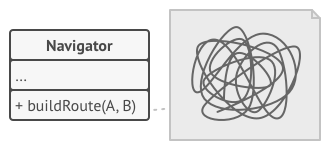
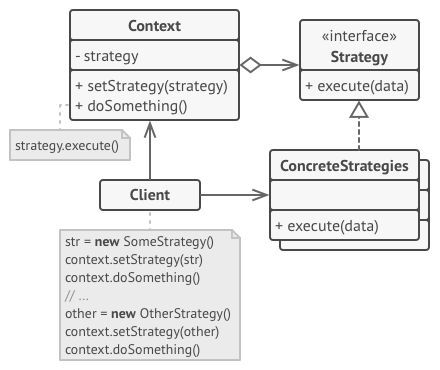

# 策略模式

策略模式是一种行为设计模式， 它能让你定义一系列算法， 并将每种算法分别放入独立的类中， 以使算法的对象能够相互替换。


## 问题

一天， 你打算为游客们创建一款导游程序。 该程序的核心功能是提供美观的地图， 以帮助用户在任何城市中快速定位。

用户期待的程序新功能是自动路线规划： 他们希望输入地址后就能在地图上看到前往目的地的最快路线。

程序的首个版本只能规划公路路线。 驾车旅行的人们对此非常满意。 但很显然， 并非所有人都会在度假时开车。 因此你在下次更新时添加了规划步行路线的功能。 此后， 你又添加了规划公共交通路线的功能。

而这只是个开始。 不久后， 你又要为骑行者规划路线。 又过了一段时间， 你又要为游览城市中的所有景点规划路线。



尽管从商业角度来看， 这款应用非常成功， 但其技术部分却让你非常头疼： 每次添加新的路线规划算法后， 导游应用中主要类的体积就会增加一倍。 终于在某个时候， 你觉得自己没法继续维护这堆代码了。

无论是修复简单缺陷还是微调街道权重， 对某个算法进行任何修改都会影响整个类， 从而增加在已有正常运行代码中引入错误的风险。

此外， 团队合作将变得低效。 如果你在应用成功发布后招募了团队成员， 他们会抱怨在合并冲突的工作上花费了太多时间。 在实现新功能的过程中， 你的团队需要修改同一个巨大的类， 这样他们所编写的代码相互之间就可能会出现冲突。

## 解决方案

策略模式建议找出负责用许多不同方式完成特定任务的类， 然后将其中的算法抽取到一组被称为*策略*的独立类中。

名为*上下文*的原始类必须包含一个成员变量来存储对于每种策略的引用。 上下文并不执行任务， 而是将工作委派给已连接的策略对象。

上下文不负责选择符合任务需要的算法——客户端会将所需策略传递给上下文。 实际上， 上下文并不十分了解策略， 它会通过同样的通用接口与所有策略进行交互， 而该接口只需暴露一个方法来触发所选策略中封装的算法即可。

因此， 上下文可独立于具体策略。 这样你就可在不修改上下文代码或其他策略的情况下添加新算法或修改已有算法了。


在导游应用中， 每个路线规划算法都可被抽取到只有一个 `build­Route`生成路线方法的独立类中。 该方法接收起点和终点作为参数， 并返回路线中途点的集合。

即使传递给每个路径规划类的参数一模一样， 其所创建的路线也可能完全不同。 主要导游类的主要工作是在地图上渲染一系列中途点， 不会在意如何选择算法。 该类中还有一个用于切换当前路径规划策略的方法， 因此客户端 （例如用户界面中的按钮） 可用其他策略替换当前选择的路径规划行为。

## 策略模式结构



- **上下文** （Context） 维护指向具体策略的引用， 且仅通过策略接口与该对象进行交流。
- **策略** （Strategy） 接口是所有具体策略的通用接口， 它声明了一个上下文用于执行策略的方法。
- **具体策略** （Concrete Strategies）实现了上下文所用算法的各种不同变体。
- 当上下文需要运行算法时， 它会在其已连接的策略对象上调用执行方法。 上下文不清楚其所涉及的策略类型与算法的执行方式。
- **客户端** （Client） 会创建一个特定策略对象并将其传递给上下文。 上下文则会提供一个设置器以便客户端在运行时替换相关联的策略。

## 真实世界类比


假如你需要前往机场。 你可以选择乘坐公共汽车、 预约出租车或骑自行车。 这些就是你的出行策略。 你可以根据预算或时间等因素来选择其中一种策略。

## 代码示例

```
//@ 出行策略
class IStrategy
{
public:
	virtual void Travel() = 0;
	virtual ~IStrategy() = default;
};

//@ 骑自行车
class BikeStrategy : public IStrategy
{
public:
	virtual void Travel() override { std::cout << "Travel by bike" << std::endl; }
};

//@ 开车
class CarStrategy : public IStrategy
{
public:
	virtual void Travel() override { std::cout << "Travel by car" << std::endl; }
};

//@ 坐火车
class TrainStrategy : public IStrategy
{
public:
	virtual void Travel() override { std::cout << "Travel by train" << std::endl; }
};

class Context
{
public:
	Context(std::shared_ptr<IStrategy> strategy) : pStrategy_(strategy) {}
	void Travel() { pStrategy_->Travel(); }

private:
	std::shared_ptr<IStrategy> pStrategy_;
};

int main()
{
	//@ 策略之间可以相互替换
	std::shared_ptr<IStrategy> bike(new BikeStrategy());
	std::shared_ptr<IStrategy> car(new CarStrategy());
	std::shared_ptr<IStrategy> train(new TrainStrategy());

	std::shared_ptr<Context> bikeContext(new Context(bike));
	std::shared_ptr<Context> carContext(new Context(car));
	std::shared_ptr<Context> trainContext(new Context(train));

	bikeContext->Travel();
	carContext->Travel();
	trainContext->Travel();

	return 0;
}
```

## 策略模式总结

### 实现方式

- 从上下文类中找出修改频率较高的算法 （也可能是用于在运行时选择某个算法变体的复杂条件运算符）。
- 声明该算法所有变体的通用策略接口。
- 将算法逐一抽取到各自的类中， 它们都必须实现策略接口。
- 在上下文类中添加一个成员变量用于保存对于策略对象的引用。 然后提供设置器以修改该成员变量。 上下文仅可通过策略接口同策略对象进行交互， 如有需要还可定义一个接口来让策略访问其数据。
- 客户端必须将上下文类与相应策略进行关联， 使上下文可以预期的方式完成其主要工作。

### 优点

- 你可以在运行时切换对象内的算法。
- 你可以将算法的实现和使用算法的代码隔离开来。
- 你可以使用组合来代替继承。
- 开闭原则。 你无需对上下文进行修改就能够引入新的策略。

### 缺点

- 如果你的算法极少发生改变， 那么没有任何理由引入新的类和接口。 使用该模式只会让程序过于复杂。
-  客户端必须知晓策略间的不同——它需要选择合适的策略。
-  许多现代编程语言支持函数类型功能，允许你在一组匿名函数中实现不同版本的算法。 这样， 你使用这些函数的方式就和使用策略对象时完全相同， 无需借助额外的类和接口来保持代码简洁。

### 适用场景

- 一个系统需要动态地在几种算法中选择一种，那么可以将这些算法封装到一个个的具体算法类中，而这些具体算法类都是一个抽象算法类的子类。换言之，这些具体算法类均有统一的接口，根据“里氏代换原则”和面向对象的多态性客户端可以选择使用任何一个具体算法类，并只需要维持一个数据类型是抽象算法类的对象。
- 一个对象有很多的行为，如果不用恰当的模式，这些行为就只好使用多重条件选择语句来实现。此时，使用策略模式，把这些行为转移到相应的具体策略类里面，就可以避免使用难以维护的多重条件选择语句。
- 不希望客户端知道复杂的、与算法相关的数据结构，在具体策略类中封装算法与相关的数据结构，可以提高算法的保密性与安全性。


