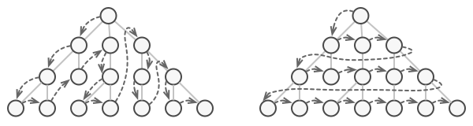
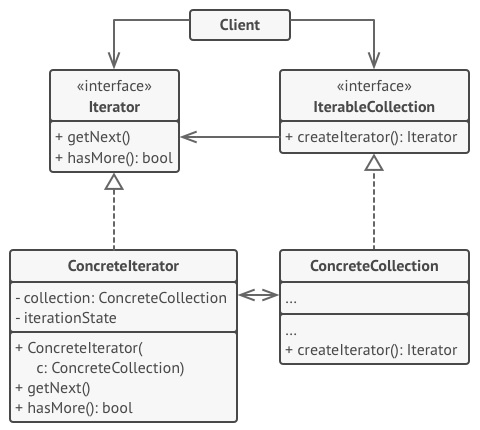

# 迭代器模式

迭代器模式是一种行为设计模式， 让你能在不暴露集合底层表现形式 （列表、 栈和树等） 的情况下遍历集合中所有的元素。


## 问题

集合是编程中最常使用的数据类型之一。 尽管如此， 集合只是一组对象的容器而已。


大部分集合使用简单列表存储元素。 但有些集合还会使用栈、 树、 图和其他复杂的数据结构。

无论集合的构成方式如何， 它都必须提供某种访问元素的方式， 便于其他代码使用其中的元素。 集合应提供一种能够遍历元素的方式， 且保证它不会周而复始地访问同一个元素。

如果你的集合基于列表， 那么这项工作听上去仿佛很简单。 但如何遍历复杂数据结构 （例如树） 中的元素呢？ 例如， 今天你需要使用深度优先算法来遍历树结构， 明天可能会需要广度优先算法； 下周则可能会需要其他方式 （比如随机存取树中的元素）。



不断向集合中添加遍历算法会模糊其 “高效存储数据” 的主要职责。 此外， 有些算法可能是根据特定应用订制的， 将其加入泛型集合类中会显得非常奇怪。

另一方面， 使用多种集合的客户端代码可能并不关心存储数据的方式。 不过由于集合提供不同的元素访问方式， 你的代码将不得不与特定集合类进行耦合。

## 解决方案

迭代器模式的主要思想是将集合的遍历行为抽取为单独的迭代器对象。


除实现自身算法外， 迭代器还封装了遍历操作的所有细节， 例如当前位置和末尾剩余元素的数量。 因此， 多个迭代器可以在相互独立的情况下同时访问集合。

迭代器通常会提供一个获取集合元素的基本方法。 客户端可不断调用该方法直至它不返回任何内容， 这意味着迭代器已经遍历了所有元素。

所有迭代器必须实现相同的接口。 这样一来， 只要有合适的迭代器， 客户端代码就能兼容任何类型的集合或遍历算法。 如果你需要采用特殊方式来遍历集合， 只需创建一个新的迭代器类即可， 无需对集合或客户端进行修改。

## 迭代器模式结构



- **迭代器** （Iterator）接口声明了遍历集合所需的操作： 获取下一个元素、 获取当前位置和重新开始迭代等。
- **具体迭代器**（Concrete Iterators） 实现遍历集合的一种特定算法。迭代器对象必须跟踪自身遍历的进度。 这使得多个迭代器可以相互独立地遍历同一集合。
- **集合** （Collection） 接口声明一个或多个方法来获取与集合兼容的迭代器。 请注意，返回方法的类型必须被声明为迭代器接口， 因此具体集合可以返回各种不同种类的迭代器。
- **具体集合** （Concrete Collections） 会在客户端请求迭代器时返回一个特定的具体迭代器类实体。 你可能会琢磨， 剩下的集合代码在什么地方呢？ 不用担心， 它也会在同一个类中。 只是这些细节对于实际模式来说并不重要， 所以我们将其省略了而已。
- **客户端** （Client） 通过集合和迭代器的接口与两者进行交互。 这样一来客户端无需与具体类进行耦合， 允许同一客户端代码使用各种不同的集合和迭代器。
  - 客户端通常不会自行创建迭代器， 而是会从集合中获取。 但在特定情况下， 客户端可以直接创建一个迭代器 （例如当客户端需要自定义特殊迭代器时）。

## 真实世界类比


你计划在罗马游览数天， 参观所有主要的旅游景点。 但在到达目的地后， 你可能会浪费很多时间绕圈子， 甚至找不到罗马斗兽场在哪里。

或者你可以购买一款智能手机上的虚拟导游程序。 这款程序非常智能而且价格不贵， 你想在景点待多久都可以。

第三种选择是用部分旅行预算雇佣一位对城市了如指掌的当地向导。 向导能根据你的喜好来安排行程， 为你介绍每个景点并讲述许多激动人心的故事。 这样的旅行可能会更有趣， 但所需费用也会更高。

所有这些选择(自由漫步、 智能手机导航或真人向导)都是这个由众多罗马景点组成的集合的迭代器。

## 代码示例

```
template <typename T, typename U>
class Iterator {
public:
	typedef typename std::vector<T>::iterator iter_type;
	Iterator(U *p_data, bool reverse = false) : m_p_data_(p_data) {
		m_it_ = m_p_data_->m_data_.begin();
	}

	void First() {
		m_it_ = m_p_data_->m_data_.begin();
	}

	void Next() {
		m_it_++;
	}

	bool IsDone() {
		return (m_it_ == m_p_data_->m_data_.end());
	}

	iter_type Current() {
		return m_it_;
	}

private:
	U *m_p_data_;
	iter_type m_it_;
};

template <class T>
class Container {
	friend class Iterator<T, Container>;

public:
	void Add(T a) {
		m_data_.push_back(a);
	}

	Iterator<T, Container> *CreateIterator() {
		return new Iterator<T, Container>(this);
	}

private:
	std::vector<T> m_data_;
};

class Data {
public:
	Data(int a = 0) : m_data_(a) {}

	void set_data(int a) {
		m_data_ = a;
	}

	int data() {
		return m_data_;
	}

private:
	int m_data_;
};

void ClientCode() {
	std::cout << "________________Iterator with int______________________________________" << std::endl;
	Container<int> cont;

	for (int i = 0; i < 10; i++) {
		cont.Add(i);
	}

	Iterator<int, Container<int>> *it = cont.CreateIterator();
	for (it->First(); !it->IsDone(); it->Next()) {
		std::cout << *it->Current() << std::endl;
	}

	Container<Data> cont2;
	Data a(100), b(1000), c(10000);
	cont2.Add(a);
	cont2.Add(b);
	cont2.Add(c);

	std::cout << "________________Iterator with custom Class______________________________" << std::endl;
	Iterator<Data, Container<Data>> *it2 = cont2.CreateIterator();
	for (it2->First(); !it2->IsDone(); it2->Next()) {
		std::cout << it2->Current()->data() << std::endl;
	}
}

int main() {
	ClientCode();
	return 0;
}
```

## 迭代器模式总结

### 实现方式

- 声明迭代器接口。 该接口必须提供至少一个方法来获取集合中的下个元素。 但为了使用方便， 你还可以添加一些其他方法， 例如获取前一个元素、 记录当前位置和判断迭代是否已结束。
- 声明集合接口并描述一个获取迭代器的方法。 其返回值必须是迭代器接口。 如果你计划拥有多组不同的迭代器， 则可以声明多个类似的方法。
- 为希望使用迭代器进行遍历的集合实现具体迭代器类。 迭代器对象必须与单个集合实体链接。 链接关系通常通过迭代器的构造函数建立。
- 在你的集合类中实现集合接口。 其主要思想是针对特定集合为客户端代码提供创建迭代器的快捷方式。 集合对象必须将自身传递给迭代器的构造函数来创建两者之间的链接。
- 检查客户端代码， 使用迭代器替代所有集合遍历代码。 每当客户端需要遍历集合元素时都会获取一个新的迭代器。

### 优点

- 单一职责原则。 通过将体积庞大的遍历算法代码抽取为独立的类， 你可对客户端代码和集合进行整理。
- 开闭原则。 你可实现新型的集合和迭代器并将其传递给现有代码， 无需修改现有代码。
- 你可以并行遍历同一集合， 因为每个迭代器对象都包含其自身的遍历状态。
- 相似的， 你可以暂停遍历并在需要时继续。

### 缺点

- 如果你的程序只与简单的集合进行交互，应用该模式可能会矫枉过正。
- 对于某些特殊集合， 使用迭代器可能比直接遍历的效率低。

### 适用场景

- 访问一个聚合对象的内容而无须暴露它的内部表示。将聚合对象的访问与内部数据的存储分离，使得访问聚合对象时无须了解其内部实现细节。
-  需要为一个聚合对象提供多种遍历方式。
-  为遍历不同的聚合结构提供一个统一的接口，在该接口的实现类中为不同的聚合结构提供不同的遍历方式，而客户端可以一致性地操作该接口。


